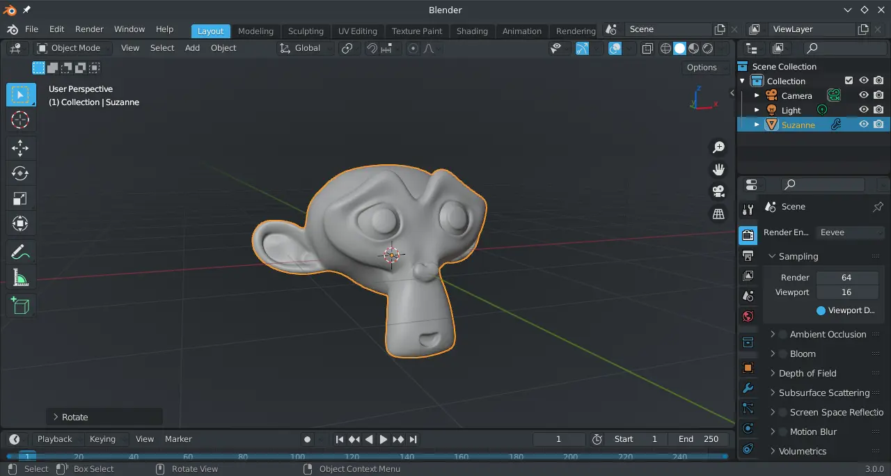

# Blender 3D

## Animasi penuh fitur

Blender 3D merupakan perangkat lunak yang menggunakan teknik diagonal 3 dimensi. Bertujuan untuk membuat objek/aset, hingga produksi animasi yang sederhana maupun realistis.

## Pengaturan tambahan

Untuk menyesuaikan dengan visual tema dan mempercepat alur kerja, di sistem operasi LangitKetujuh beberapa pengaturan ada yang diganti, seperti:
- Menggunakan tema `Breeze Dark`.
- Pada bagian tampilan ketika mode rendering tetap dalam jendela yang sama (Render in: Keep User Interface).
- Pada bagian input, mengaktifkan `Emulate Numpad` dan `Emulate 3 Button Mouse`.
- Pada bagian navigasi, mengaktifkan `Auto Depth` dan `Zoom to Mouse Position`.
- Pada bagian viewport, menggunakan `Simple Axis`.

## Dokumentasi

Anda dapat belajar dan menjelajahi fitur Blender 3D melalui halaman dokumentasi resminya <https://docs.blender.org>. Anda juga dapat berlangganan konten kreatif para pengembangnya di <https://studio.blender.org>
