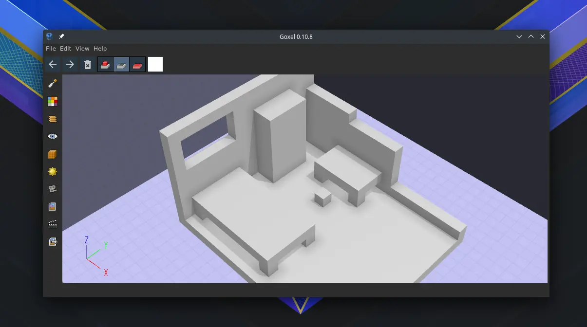
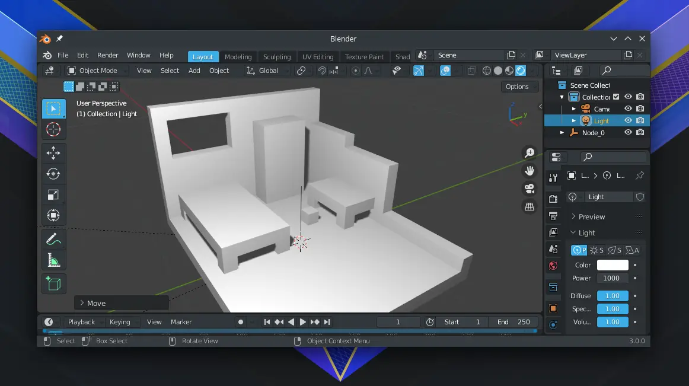

# Goxel

## Deskripsi

[Goxel] merupakan perangkat lunak berlisensikan GPL-3.0 yang digunakan untuk mengolah objek voxel untuk komputer desktop dan perangkat seluler. [Goxel] sama intuitifnya seperti menggambar 2D piksel, namun dengan 3 dimensi. Umumnya digunakan untuk keperluan video game.

### Apa itu Voxel?

Voxel adalah singkatan dari "Volumetrix Pixel" yaitu setara dengan 3D dari piksel dua dimensi. Sama seperti 2D yang di representasikan sebagai kisi piksel, gambar 3D juga dipresentasikan sebagai kisi voxel 3D yang dimana setiap titik grid mewakili warna dan posisi tertentu.



[Goxel] juga mendukung export ke `gITF` yang sangat kompatibel dengan [Blender 3D] dan [Godot] Game Engine. Hal ini luar biasa sebab format `gITF` merupakan format 3D terbuka yang mendukung objek data. `gITF` dibuat oleh Kronos group yang inisiator teknologi grafis [Vulkan].



## Cara memasang

```
get goxel l7-goxel
```

Gunakan pengaturan tambahan.

```
cp -rfv /etc/skel/.config/goxel ~/.config/
```

## Pengaturan tambahan

- Menggunakan tema `Dark` untuk menyesuaikan dengan tema gelap bawaan.

[Goxel]:https://goxel.xyz/
[Blender 3D]:./blender.md
[Godot]:../game/godot.md
[Vulkan]:../../konfigurasi/driver/grafis/vulkan.md
