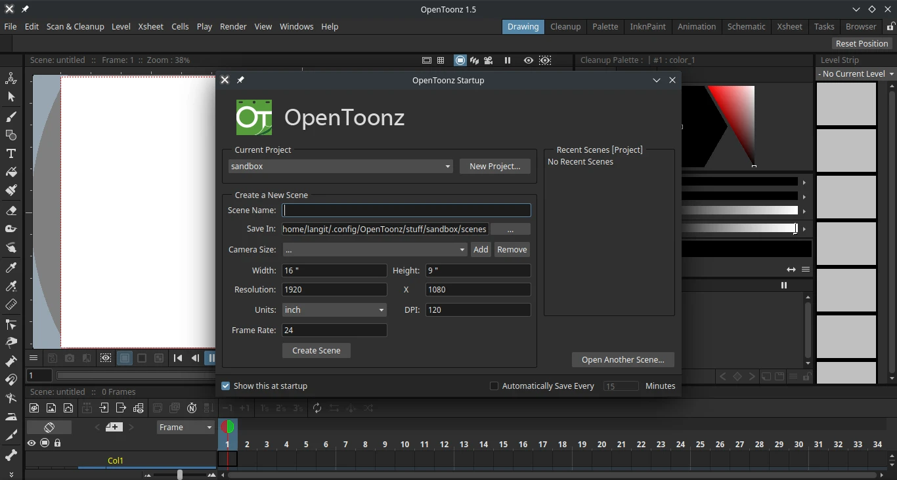

# Opentoonz

## Deskripsi

[OpenToonz](https://opentoonz.github.io/e/) merupakan perangkat lunak terbuka yang digunakan sebagai pengolah animasi dua dimensi berbasis raster. OpenToonz berbasis dari perangkat lunak [Toonz](http://www.toonz.com/) yang dikembangkan di italia oleh [Digital Video S.p.A](https://www.digitalvideo.biz) serta dikembangkan oleh [Studio Ghibli jepang](https://www.ghibli.jp/) yang sudah digunakannya bertahun-tahun. Kemudian [Dwango](http://dwango.co.jp/english/) merilis proyek OpenToonz dengan kontribusi dari Digital Video dan Studio Ghibli.

Meskipun berbasis raster, OpenToonz juga kompatibel dengan animasi vektor. Kode sumber OpenToonz dapat dimodifikasi secara bebas, pengguna dapat menggunakannya baik untuk keperluan personal dan proyek komersil. OpenToonz juga dapat digunakan oleh studio indi, studio profesional, dan untuk keperluan edukasi multimedia.

## Cara memasang

```sh
doas xbps-install -S {,l7-}opentoonz
```

## Pengaturan tambahan

Beberapa pengaturan tambahan opentoonz di LangitKetujuh antara lain:
- Menggunakan tema `Dark`.
- Font yang digunakan `Noto Sans [MONO]`.
- Tampilan area kerja fullscreen.
- Path ffmpeg untuk rendering animasi `/usr/bin`.



## Dokumentasi

Pengguna dapat belajar dan menjelajahi fitur opentoonz melalui halaman [dokumentasi resmi](https://opentoonz.readthedocs.io/en/latest).
