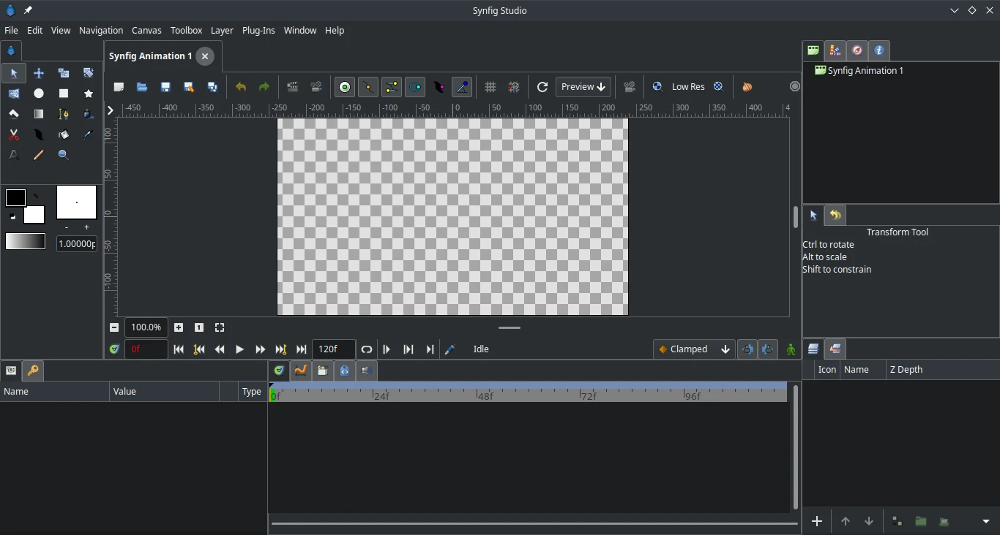

# Synfig Studio

## Deskripsi

[Synfig Studio] merupakan perangkat lunak berbasis Qt untuk animasi dua dimensi berbasis vektor. Tidak seperti teknik animasi secara tradisonal dengan _frame by frame_, teknik animasi yang digunakan [Synfig Studio] menggunakan teknik yang berbeda yaitu Morphing dan Cutout animation.



## Cara memasang

```sh
doas xbps-install -Sy synfigstudio
```

## Dokumentasi

Pengguna dapat belajar dan menjelajahi fitur [Synfig Studio] melalui halaman [dokumentasi resmi] dan di [wiki].

[Synfig Studio]:https://www.synfig.org/
[dokumentasi resmi]:https://synfig.readthedocs.io/en/latest/index.html
[wiki]:https://wiki.synfig.org
