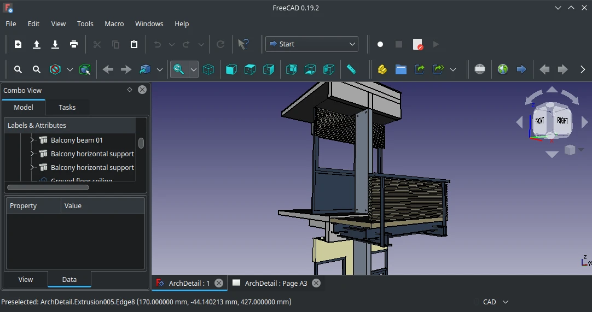

# FreeCAD

## Deskripsi

Perangkat lunak [FreeCAD] merupakan perangkat lunak desain parametrik (ukuran terperinci) 3D yang sepenuhnya terbuka, dibawah lisensi GPL dan LGPL. [FreeCAD] digunakan untuk teknik mesin, desain produk, keperluan arsitek dan bidang teknik parametrik lainnya.



[FreeCAD] dibekali pemodelan berbasis parametrik dengan sistem modul sehingga memudahkan merubah jumlah fitur tanpa memodifikasi sistem intinya. Kelebihan dari [FreeCAD] sendiri menggunakan pustaka yang terbuka (sumber terbuka), dibuat dengan framework Qt antar muka yang terkenal, dan bahasa pemrograman python yang handal.

[FreeCAD] mendukung multi-platform, artinya dapat digunakan pada sistem Windows, Linux, dan MacOS. Perangkat lunak ini dikembangkan oleh para pengembang, relawan yang antusias dan komunitas yang hebat. Pengguna dapat bergabung di [FreeCAD forum] agar saling berbagi ide dan inspirasi.

## Cara memasang

```sh
get freecad
```

## Dokumentasi

Pengguna dapat memulai belajar dan menjelajahi fitur di [FreeCAD wiki](https://wiki.freecadweb.org/index.php?title=Getting_started).

[FreeCAD]:https://freecadweb.org
[FreeCAD forum]:http://forum.freecadweb.org/
[FreeCAD wiki]:https://wiki.freecadweb.org/index.php?title=Getting_started
