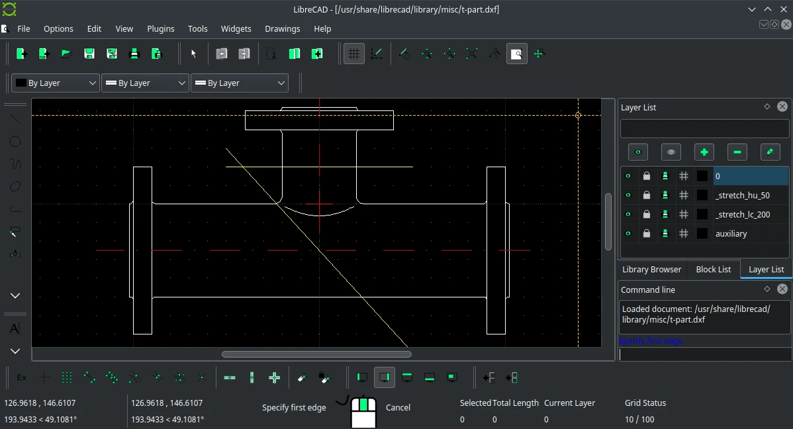

# LibreCAD

## Deskripsi

[LibreCAD](https://librecad.org/) merupakan perangkat lunak pendukung desain 2D untuk menggambar teknik isometrik 3D. Desain antarmuka LibreCAD menggunakan konsep dan analogi dari AutoCAD perangkat lunak komersil.

LibreCAD menggunakan `.dxf` sebagai format utama untuk mengimpor dan mengekspor ke berbagai format seperti png, jpg, dan pdf.

## Dokumentasi

Pengguna dapat mempelajari lebih lanjut melalui [LibreCAD wiki](https://dokuwiki.librecad.org/doku.php), sebuah panduan manual dan tutorial bagaimana LibreCAD digunakan.
