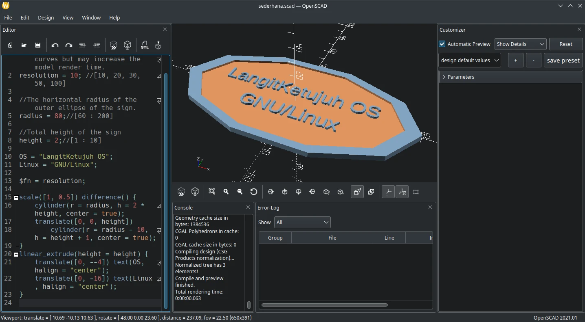

# OpensCAD

## Deskripsi

[OpensCAD] merupakan perangkat lunak desain parametrik 3D yang berbasis skrip `scad`. OpensCAD tidak digunakan dalam hal artistik suatu model selayaknya Blender3D, melainkan fokus ke desain CAD itu sendiri. OpensCAD digunakan untuk merancang desain produk, prototype, arsitektur, arkeolog, dan keperluan medis. Hasil OpensCAD `.stl` dapat digunakan untuk 3D printing.



## Cara memasang

```
get openscad l7-openscad
```

Gunakan pengaturan tambahan.

```
cp -rfv /etc/skel/.config/OpenSCAD ~/.config/
```

Pengaturan tambahan menggunakan tema `Tomorrow Night` untuk menyesuaikan dengan tema gelap.

## Dokumentasi

Pengguna dapat mempelajari lebih lanjut melalui [OpensCAD wiki], sebuah panduan manual dan tutorial bagaimana OpensCAD digunakan.

[OpensCAD]:https://openscad.org/
[OpensCAD wiki]:https://openscad.org/documentation.html
