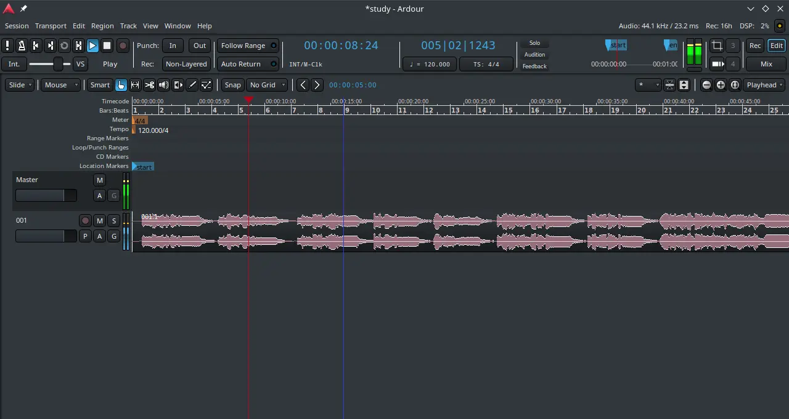

# Ardour

## Deskripsi

[Ardour](https://www.ardour.org/) merupakan perangkat bebas yang digunakan untuk _digital audio workstation_ (DAW) secara profesional dan dibawah lisensi GNU GPLv2.



Ardour memiliki kemudahan dalam penyuntingan, seperti menggabungkan, memotong, _trimming_, dan _mix_. Dengan adanya fitur layer, undo/redo tak terbatas, dan simpan otomatis dnegan _snapshot_ akan memudahkan untuk menyimpan sesi terakhir kali.

Ardour memiliki banyak program tambahan dan fitur seperti audio efek pemroses kontrol dinamis, itu memungkinkan untuk mengkombinasikan antar platform. Bahkan sejak versi 6.5 sudah mendukung VST3 untuk mendukung semua platform. Dari segi tampilan antarmuka, Ardour menggunakan tema gelap untuk menyesuaikan global tema.

## Cara memasang

```sh
doas xbps-install -Sy {,l7-}ardour
```

## Dokumentasi

Pengguna dapat menjelajahi fitur Ardour lebih lanjut di [Ardour Manual](https://manual.ardour.org/).
