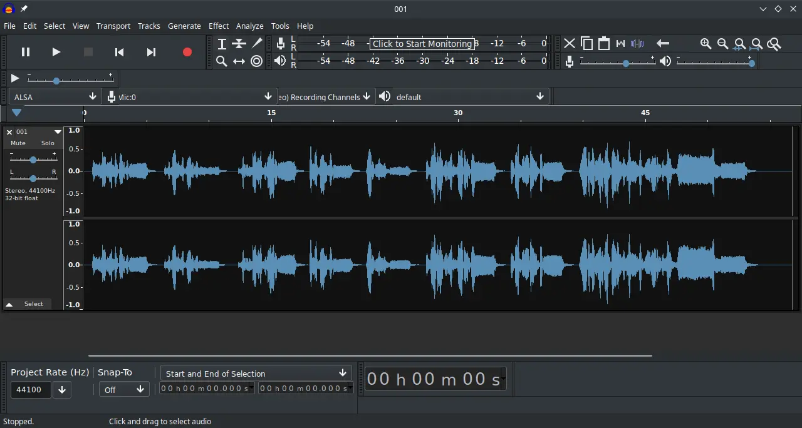

# Audacity

## Deskripsi

[Audacity](https://audacityteam.org/) memungkin pengguna untuk memperbaiki kualitas audio. Seperti normalisasi, pengaturan echo, noise reduction dan pengoreksi audio lainnya. Pengguna juga dapat berkreasi dengan suara yang dimiliki sendiri dan ditambahkan efek yang tersedia.

Di LangitKetujuh, Audacity menggunakan tema gelap untuk disesuaikan dengan tema globalnya meskipun dari penampilan antarmuka masih cenderung kaku.

## Dokumentasi

Panduan dan tutorial tentang audacity lebih lanjut dapat dipelajari di [dokumentasi manual](https://manual.audacityteam.org/) dan [wiki](https://wiki.audacityteam.org/wiki/Audacity_Wiki_Home_Page) yang sudah disediakan.
