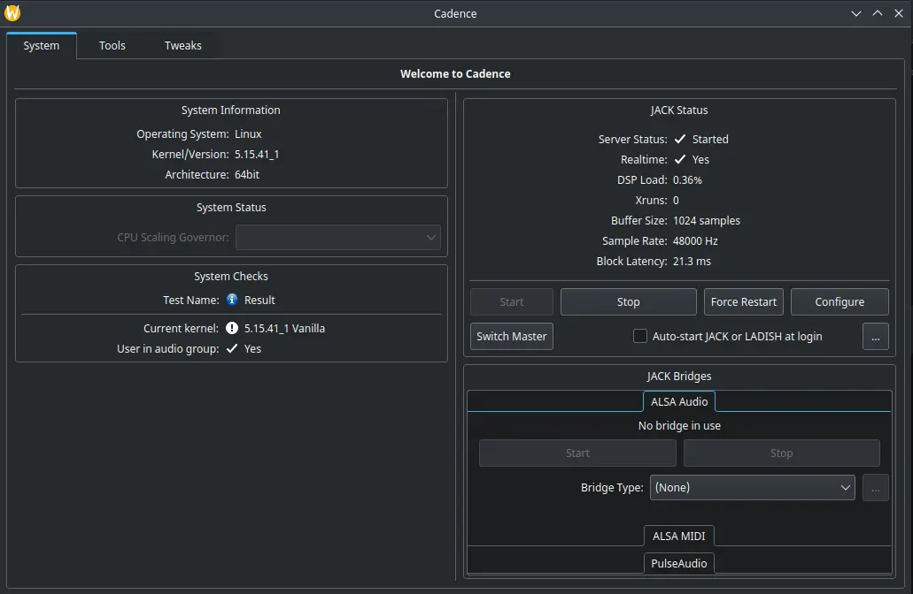
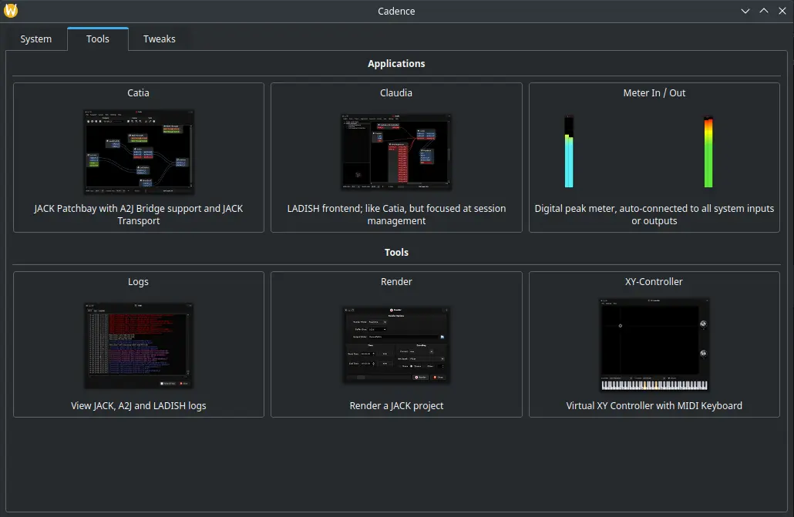

# Cadence

## Deskripsi

[Cadence] merupakan kumpulan perkakas yang digunakan untuk produksi audio. Perkakas tersebut yaitu Catarina, Catia, dan Claudia. Pada dasarnya Cadence digunakan untuk menjalankan JACK audio server kemudian dapat dikombinasikan dengan plugin yang tersedia di [Carla].

Perkakas Cadence memiliki fungsi tersendiri. Catia sebagai Jack Patchbay, Claudia sebagai frontend untuk manajemen audio sesi LADISH, dan digital meter untuk mengetahui grafik input/output audio.

[Cadence]:https://kx.studio/Applications:Cadence
[Carla]:carla.md
