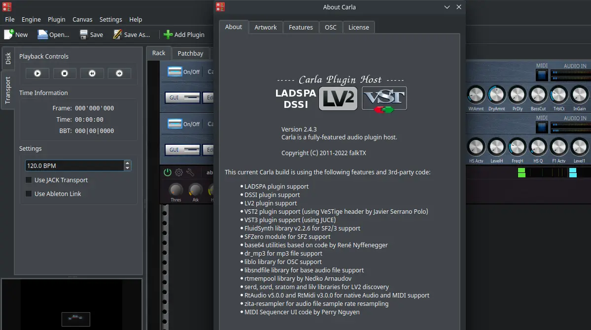
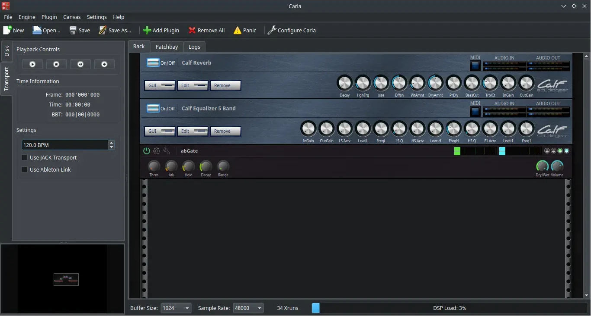
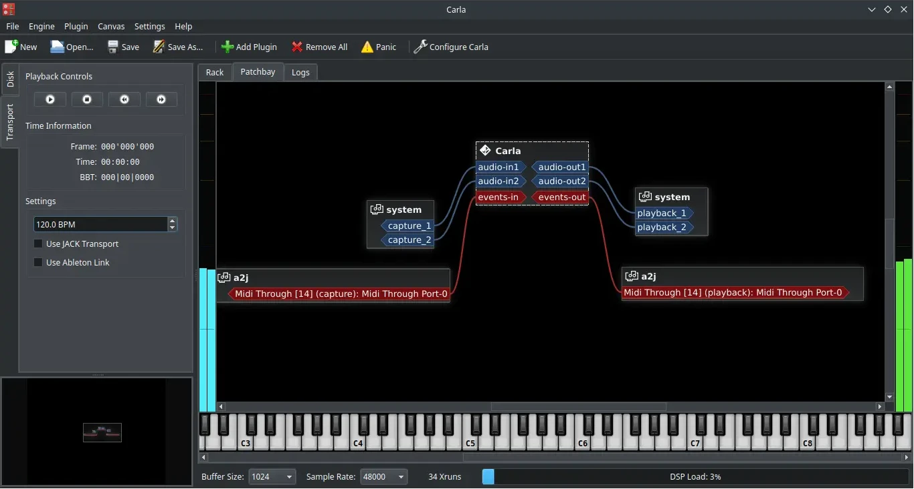
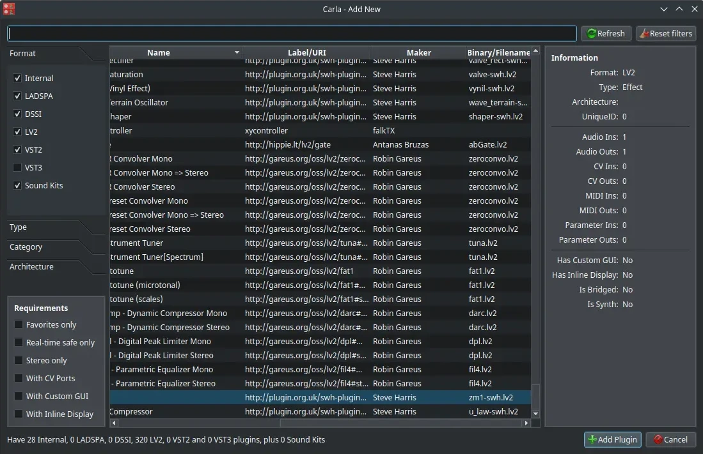

# Carla

## Deskripsi

[Carla] adalah perangkat lunak bebas yang digunakan untuk memanajemen plugin host audio. Secara bawaan menggunakan JACK sebagai audio driver, tetapi dapat juga dikonfigurasi dengan Alsa dan Pulseaudio.

Carla memerlukan perangkat lunak lain untuk menjalankan JACK Server, seperti [Cadence] atau Qjackctl. Dengan latensi yang rendah dan dipadukan dengan JACK, Carla direkomendasikan untuk produksi dan perekaman audio.



Terdapat pengaturan GUI untuk plugin Calf Gear Studio.



Dukungan Patchbay untuk mengkoneksikan antar perangkat system input dan output audio.



Banyak plugin yang tersedia, seperti `abGate`, `calf`, `invada-studio-plugins`, `swh-lv2`, dan `x42-plugins`.



## Cara memasang

Carla tersedia di repositori dan dapat dipasang melalui [octoxbps] atau konsole.

```sh
get Carla l7-carla
```

[Carla]:https://kx.studio/Applications:Carla
[Cadence]:cadence.md
[octoxbps]:../perkakas/octoxbps.md
