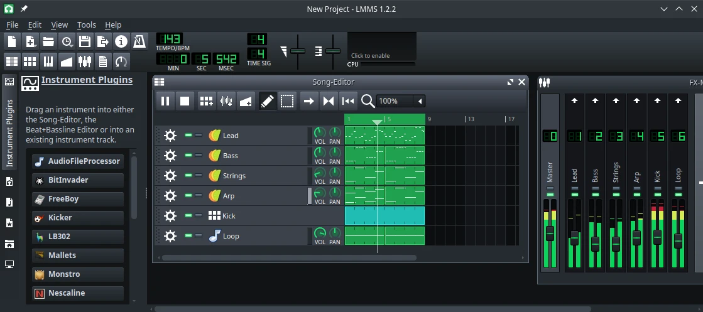

# LMMS

## Deskripsi

[LMMS] (Linux Multimedia Studio) adalah perangkat lunak yang memungkinkan pengguna untuk membuat efek ketukan dan campuran suara dengan digital. LMMS tersedia sebagai perangkat lunak cross platform dan berbagai macam instrument plugins yang dapat digunakan oleh pengguna secara bebas.



## Cara memasang

```sh
doas xbps-install -Sy lmms
```

## Dokumentasi

Pengguna dapat menjelajahi fitur dan mempelajari lebih lanjut di [LMMS Manual]. Pengguna juga dapat berbagi motivasi dan karya di forum [LMMS LSP].

[LMMS]:https://lmms.io/
[LMMS Manual]:https://docs.lmms.io/user-manual
[LMMS LSP]:https://lmms.io/lsp/
