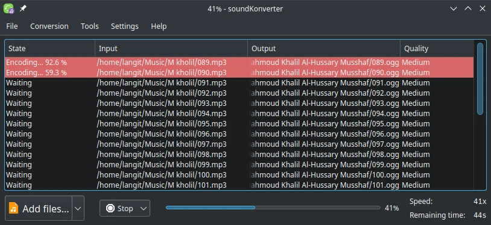

# SoundKonverter

## Konversi suara

SoundKonverter merupakan perangkat lunak yang bertujuan mengkonversi format ekstensi audio. Ekstensi yang didukung diantaranya `ogg`, `m4a`, `mp3`, `acc`, `opus`, `ra`, dan lain-lain.

Kami menyarankan menggunakan ekstensi `ogg`, sebab legal dan bebas dari pembatasan lisensi. SoundKonverter dikembangkan dengan framework Qt, sehingga tema yang digunakan sesuai dengan lingkungan Plasma.

Jika pengguna memerlukan konversi video, dapat menggunakan [HandBrake](../video/handbrake.md). Sedangkan untuk konversi gambar dapat menggunakan [Converseen](../grafis/converseen.md).
