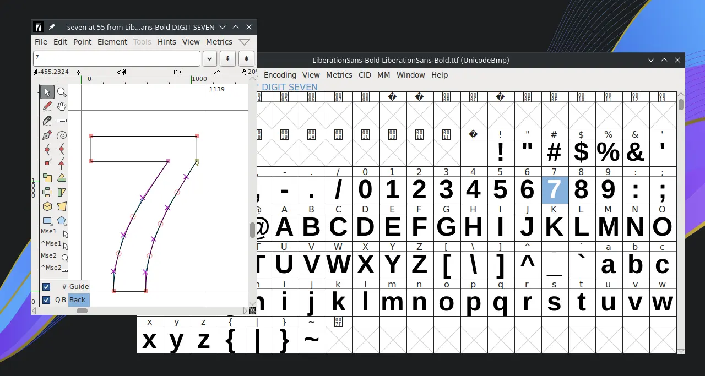

# FontForge

## Deskripsi

[FontForge] merupakan perangkat lunak terbuka untuk menyunting, memodifikasi, mengkonversi dan merancang font yang sesuai dengan kreatifitas pengguna.



FontForge mendukung semua format font yang umum seperti TrueType, Bitmap dan PostScript. FontForge juga memiliki dukungan untuk mengimpor dari berkas editor perangkat lunak lain seperti di `.svg` [Inkscape].

## Cara memasang

```sh
get fontforge
```

## Dokumentasi

Pengguna dapat menjelajahi fitur [FontForge] lebih lanjut di [dokumentasi resmi] dan [Ebook] yang tersedia.

[FontForge]:https://fontforge.org/
[Inkscape]:../grafis/inkscape.md
[dokumentasi resmi]:https://fontforge.org/en-US/documentation/
[Ebook]:http://designwithfontforge.com/
