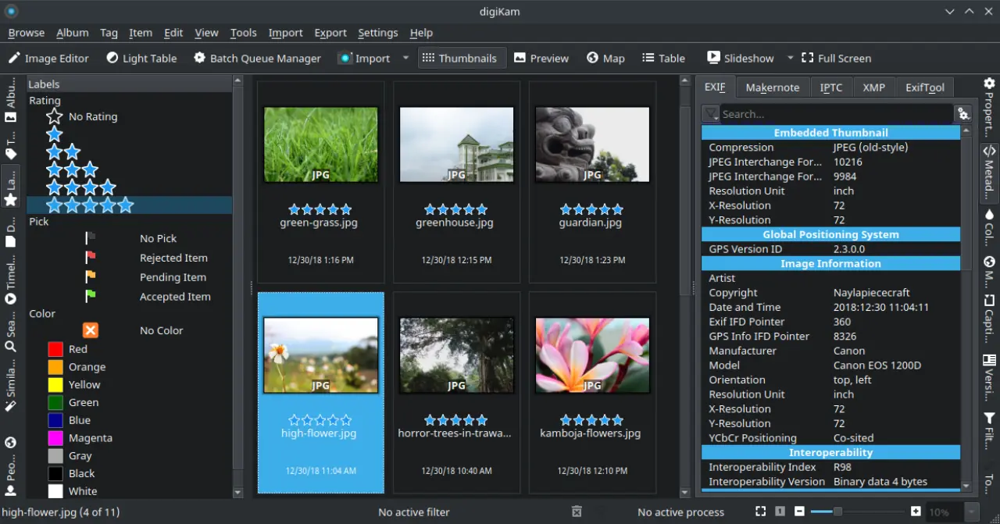

# digiKam

## Deskripsi

[digiKam](https://www.digikam.org/) merupakan perangkat lunak terbuka yang digunakan untuk mengelola, menyunting dan berbagi berkas foto. Dengan digiKam memungkinkan pengguna untuk mentransfer dan memproses berkas foto dari kamera dengan lebih cepat.

digiKam memiliki fitur untuk memberikan label, peringkat, dan tanda lainnya untuk mengelola setiap item. Pengguna juga dapat menggunakan fitur filter untuk mencari foto berdasarkan penanda yang telah dibuat sebelumnya. Dengan demikian, digiKam mampu mengkategorikan setiap kriteria dan membuat katalog dengan mudah.

Meskipun untuk menejemen foto, digiKam juga dilengkapi alat dasar penyesuaian warna, memangkas dan mempertajam gambar, menggabungkan foto panorama seperti [hugin](../grafis/hugin.md), dan masih banyak lagi.

Dukungan 110 perangkat lebih, dukungan 900 format RAW, dan fitur lainnya, digiKam sudah sangat mendukung untuk mengelola foto untuk semua kalangan. Baik untuk awam maupun profesional.

## Dokumentasi

Pengguna dapat mempelajari digiKam lebih lanjut melalui [dokumentasi](https://www.digikam.org/documentation/) dan [Ebook Profesional](https://www.digikam.org/recipes_book/).
