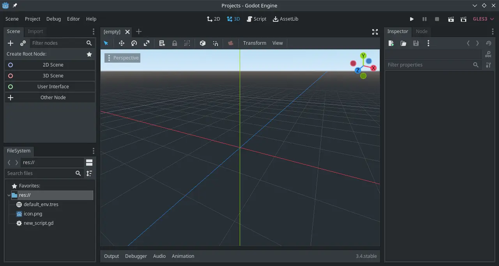
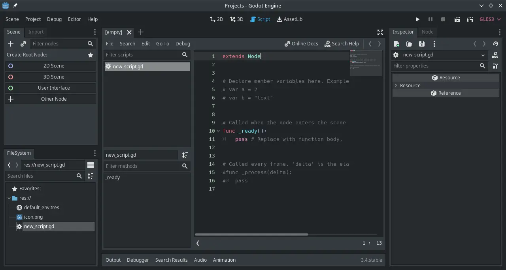

# Godot

## Deskripsi

[Godot] merupakan perangkat lunak untuk merancang dan mengembangkan video game 2D dan 3D, dibawah lisensi MIT dan tersedia untuk berbagai platform. [Godot] dikembangkan oleh komunitas yang antusias dari berbegai negara.

[Godot] menggunakan C++ dan [GDscript] _(python-like)_ sebagai bahasa pemrogramannya. Pengguna dapat mengembangakan permainan dari genre apapun dan tanpa memiliki batasan penggunaan, tentunya juga dapat digunakan secara bebas untuk membuat proyek video game komersil.

```
func _ready():
    $Label.text = "Hai Sahabat!"
```



[Godot] memiliki built-in script editor dengan indentasi otomatis, syntax highlighting dan pelengkap kode. Serta memiliki _physics engine_ tersendiri untuk aspek 2D/3D. Kami yakin bahwa godot mampu membuat video game dengan visual yang menjanjikan.



## Cara memasang

```sh
get godot l7-godot
```

Gunakan pengaturan tambahan.

```sh
cp -rfv /etc/skel/.config/godot/ ~/.config/
```

## Pengaturan tambahan

Beberapa pengaturan godot yang ditambahkan di LangitKetujuh  seperti menggunakan tema gelap  yang serupa dengan `Breeze`. Ukuran font utama `12px` dan font koding `13px`.

## Dokumentasi

[Godot] memiliki sumber daya tutorial dan panduan yang lengkap. Pengguna dapat belajar dan menjelajahi fitur melalui halaman [dokumentasi resmi](https://docs.godotengine.org/). Kami sangat menyarankan untuk memulai dari dokumentasi resmi terlebih dahulu, karena lebih terstruktur dan dari pengembangnya langsung.

[Godot]:https://godotengine.org
[GDscript]:https://gdscript.com/
