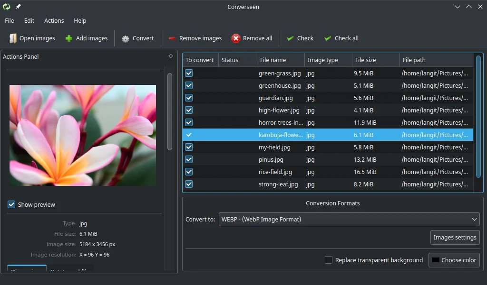

# Converseen

## Deskripsi

[Converseen](https://converseen.fasterland.net/) merupakan perangkat lunak untuk mengkonversi gambar secara satuan atau bersamaan (batch). Converseen dikembangkan dengan bahasa C++ dan pustaka Qt5 untuk tampilan desktopnya.

Untuk pemrosesan gambar, converseen menggunakan ImageMagick++ sehingga mendukung 100 lebih format, termasuk format terkenal seperti dpx, exr, gif, jpg, jpeg, pdf, photocd, png, postscript, svg, tiff dan masih banyak lagi. Dengan demikian, Converseen dapat dikatakan sebagai ImageMagick versi GUI.



Penggunaannya juga sangat sederhana. Tambahkan gambar, ceklis gambar yang akan dikonversi, dan klik _Convert_. Semua gambar akan terkonversi dengan cepat.

## Cara memasang

```sh
doas xbps-install -S Converseen
```

Jika pengguna memerlukan konversi video, dapat menggunakan [HandBrake](../video/handbrake.md). Sedangkan untuk konversi audio dapat menggunakan [soundKonverter](../audio/soundkonverter.md).
