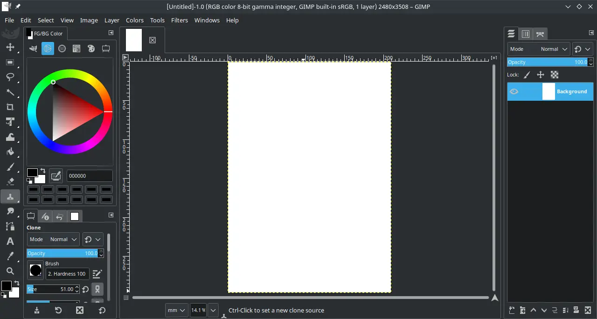

# GIMP

## Deskripsi

[GIMP] merupakan akronim dari _GNU Image Manipulation Program_ yang dikembangkan dan didistribusikan secara bebas ke berbagai platform. Seperti GNU/Linux, Windows, MacOS dan BSD. [GIMP] sangat diminati oleh praktisi desain grafis sebagai pengolah grafis berbasis raster.

Banyak fitur dan efek yang disediakan oleh [GIMP]. Di LangitKetujuh [Edisi Studio] sudah terintegrasi dengan [GMIC-Qt] untuk mengatur efek gambar dengan instan dan mudah.



## Cara memasang

```sh
doas xbps-install -Sy {,l7-}gimp
cp -rfv /etc/skel/.config/GIMP/ ~/.config/
```

Jika ingin menambahkan plugin gimp gmic, bisa merujuk ke halaman [GMIC-Qt].

## Pengaturan tambahan

Beberapa pengaturan GIMP di LangitKetujuh yang ditambahkan diantaranya:

- Menggunakan tema sistem, yaitu `breeze-dark`.
- Menggunakan ikon `Symbolic`.
- Menggunakan profil warna sRGB `sRGB-elle-V2-srgbtrc.icc` krita.
- Menggunakan profil warna CMYK `Chemical Proof` krita.
- Sisi sebelah kanan digunakan hanya panel layer saja, agar manajemen layer lebih leluasa.
- Sisi sebelah kiri digunakan untuk panel properti dan warna.

## Dokumentasi

Setiap pengguna dapat memepelajari dan menjelajahi fitur GIMP melalui halaman [dokumentasi resmi] dan di [ebook] yang tersedia.

[GIMP]:https://www.gimp.org/
[Edisi Studio]:../../perbandingan/edisi.md#studio
[GMIC-Qt]:gmic-qt.md
[dokumentasi resmi]:https://www.gimp.org/docs/
[ebook]:https://www.gimp.org/books/
