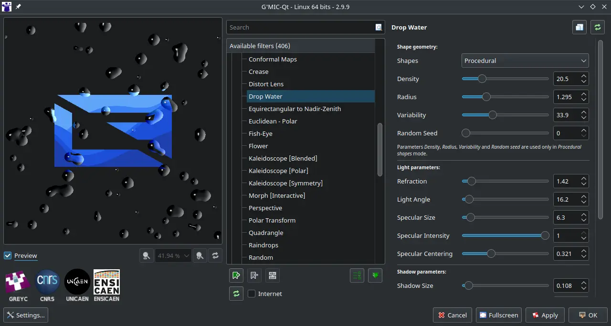

# GMIC-Qt

## Deskripsi

[GMIC-Qt] berasal dari akronim _GREYC's Magic for Image Computing_ merupakan program tambahan sebagai pengolah dan pemroses gambar raster secara instan dengan framework Qt sebagai teknologi tampilan antarmuka modern yang digunakan oleh KDE. [GMIC-Qt] dapat diintegrasikan dengan perangkat lunak editor gambar lainnya seperti [GIMP] dan [Krita].



## Cara memasang

```
get gmic
```

Plugin tambahan (opsional):

- `gmic-gimp` Plugin tambahan untuk gimp.
- `gmic-krita` Plugin tambahan untuk krita.
- `gmic-zart` Plugin tambahan untuk zart.

Memasang plugin:

```
get gmic-{krita,gimp,zart}
```

## Cara penggunaan

Penggunaan [GMIC-Qt] di [Krita] dan [GIMP] relatif sama.
- Klik layer saat ini.
- Pilih menu `Filter` > `Start G'MIC-Qt` untuk Krita.
- Pilih menu `Filter` > `GMIC-Qt` untuk GIMP.

## Dokumentasi

Pengguna dapat belajar dan menjelajahi fitur [GMIC-Qt] melalui halaman [referensi].

[GMIC-Qt]:https://gmic.eu/
[GIMP]:gimp.md
[Krita]:krita.md
[referensi]:https://gmic.eu/reference/
