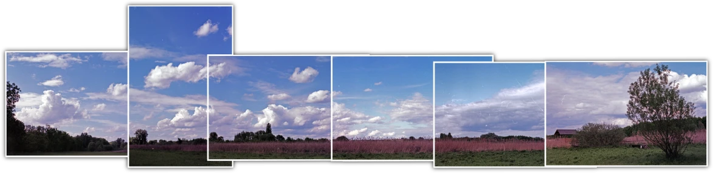
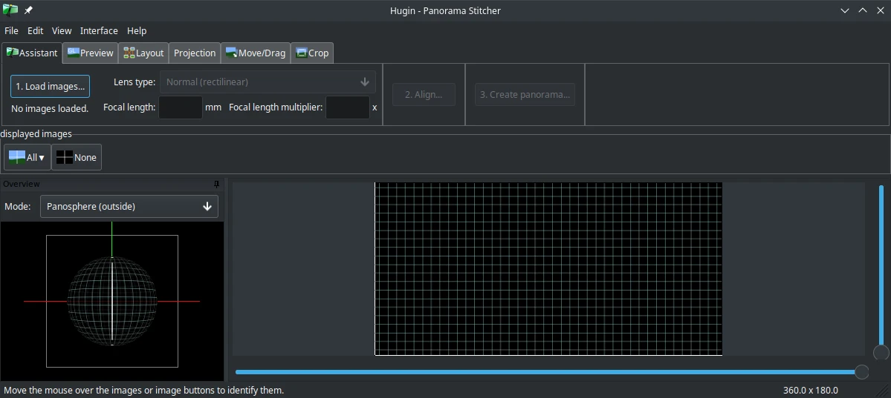

# Hugin Panorama Creator

## Digital foto panorama

[Hugin](http://hugin.sourceforge.net/) merupakan perangkat lunak terbuka untuk distribusi _cross platform_, seperti GNU/Linux, MacOS, Windows, dan BSD. Hugin digunakan untuk membuat foto panorama hingga foto 360°. Tekniknya seperti menambal/menjahit foto sehingga tampak foto yang menyambung.

Hugin memudahkan untuk membuat dari 2 gambar (ada fitur otomatis sebagai opsional), mengoptimasi, dan mentransformasi bentuk foto sehingga menjadi tampilan panorama dan menyimpan dengan format gambar pada umumnya.

## Dokumentasi

Pengguna dapat belajar dan menjelajahi fitur Hugin melalui halaman [wiki](https://wiki.panotools.org/Hugin) yang telah disediakan.
