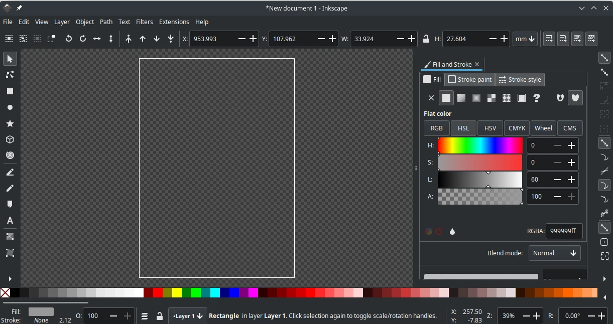
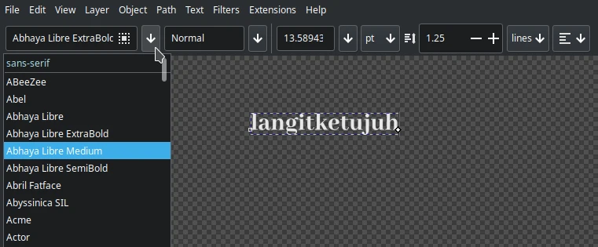
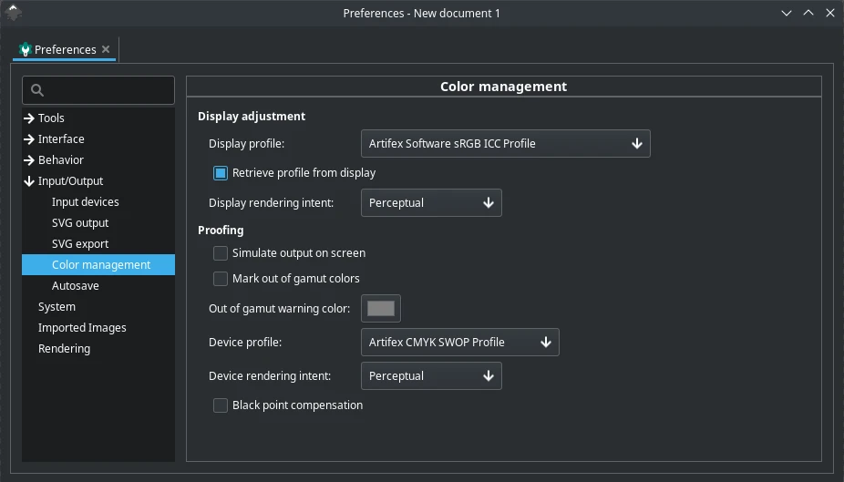

# Inkscape

## Deskripsi

[Inkscape] merupakan salah satu perangkat lunak pengolah vektor yang memiliki banyak fitur. Sebagai perangkat lunak cross platform yang dimana tersedia untuk Windows, Mac, BSD, dan GNU/Linux (flatpak, appimage, snap) serta tersedia dalam kode sumber. Perangkat lunak terbuka ini dikembangkan dari GTK+3 menggunakan bahasa C++ dan Python sebagai program ekstensi tambahan.



## Cara memasang

```sh
doas xbps-install -Sy {,l7-}inkscape
cp -rfv /etc/skel/.config/inkscape/ ~/.config/
```

Plugin tambahan (opsional):

- `inkscape-generate-palette` Menciptakan palet warna.
- `inkscape-inx-pathops` Operasi path secara bersamaan.
- `inkscape-multicalendar` Versi extend dari svgcalendar.
- `inkscape-nextgenerator` Pengganti string dalam berkas svg.

Memasang plugin:

```sh
doas xbps-install -Sy \
inkscape-{generate-palette,inx-pathops,multicalendar,nextgenerator}
```

## Pengaturan tambahan

Beberapa pengaturan inkscape yang ditambahkan di sistem operasi LangitKetujuh adalah sebagai berikut:

- Menggunakan latar belakang gelap transparan (dark-check).
- Dari segi tampilannya, tidak mengaktifkan `ruller`, `command bar`, dan `scrool bar`. Ini bertujuan untuk melebarkan area kerja.
- Tidak mengaktifkan `font samples`, sehingga tidak memerlukan rendering dan lebih cepat menampilkan font.



- Menggunakan 8 thread.
- Autosave dengan durasi setiap 2 menit.
- Profil tampilan menggunakan `sRGB-elle-V2-srgbtrc` dan proofing CMYK menggunakan `Chemical Proof` krita, sehingga kompatibel dengan profil warna yang ada di [Krita].



## Dokumentasi

Pengguna dapat belajar dan menjelajahi fitur [Inkscape] melalui halaman [dokumentasi] dan [wiki inkscape].

[Inkscape]:https://inkscape.org/
[dokumentasi]:https://inkscape-manuals.readthedocs.io/en/latest
[wiki inkscape]:https://wiki.inkscape.org/wiki/index.php/Inkscape
[Krita]:krita.md
