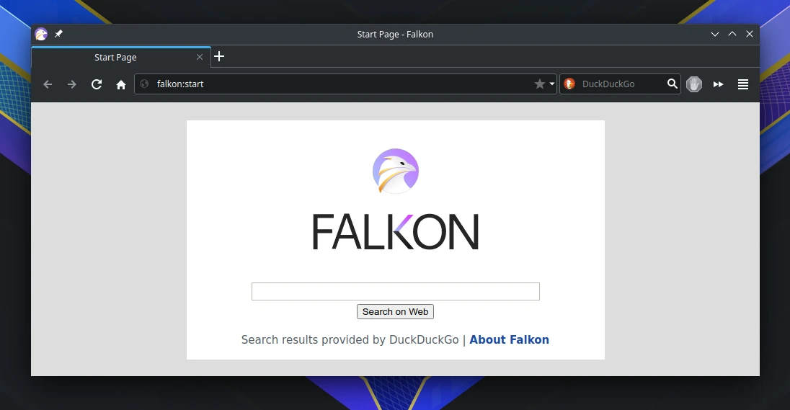

# Falkon

## Deskripsi

Falkon merupakan perangkat lunak bebas untuk menjelajahi web, atau yang lebih dikenal sebagai _web browser_. Falkon berbasis Qt dan menggunakan QTWebEngine sebagai pemroses bagian _backend_ serta terintegrasi dengan lingkungan desktop kde plasma. Kami menyarankan untuk menggunakan falkon, sebab daya memori yang digunakan cukup rendah dan secara bawaan sudah memiliki pemblokir iklan.

Hal menarik dari falkon adalah memiliki pengelola sesi setiap pengguna sehingga lebih aman dalam menyimpan data lokal internet (cache, kuki dan basisdata). Selain itu, setiap kata sandi yang tersimpan dalam falkon akan disimpan melalui KDE Wallet. Pengguna dapat mengelola dan mengekspornya jika sewaktu-waktu dibutuhkan.



## Cara memasang

```sh
doas xbps-install -S {,l7-}falkon
cp -fv /etc/skel/.config/falkon/ ~/.config/
```

## Pengaturan tambahan

Beberapa pengaturan tambahan dengan `l7-falkon`:

- Terintegrasi dengan `kget` sebagai download manager.
- Mengaktifkan plugin `GreaseMonkey`.
- Menggunakan native scroolbar
- Mengaktifkan `DoNotTrack` untuk lebih privasi.
- Mengaktifkan dukungan screen capture.
- Mengaktifkan penyaringan kuki pihak ketiga.
- Mengaktifkan penyaringan pelacak kuki.
