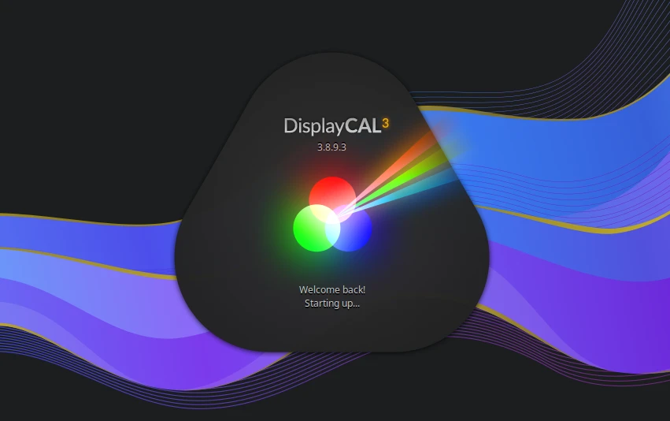
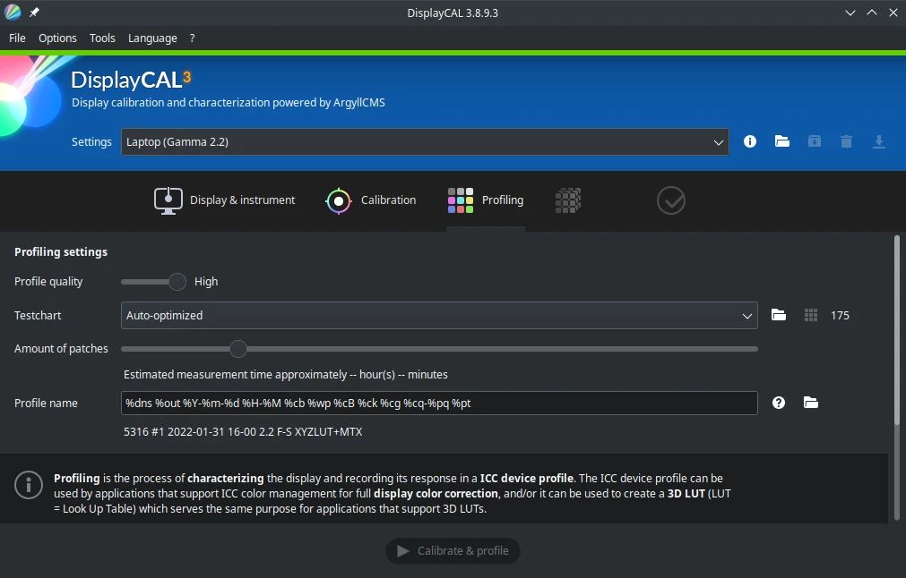

# DisplayCAL

## Deskripsi

[DisplayCAL](https://displaycal.net/) merupakan perangkat lunak bebas untuk kalibrasi warna dan profil tampilan yang berfokus pada tingkat akurasi dan keserbagunaan. DisplayCAL menggunakan program adalah [Argyll CMS](http://www.argyllcms.com/) yang merupakan sistem manajemen warna sumber terbuka yang digunakan untuk melakukan pengukuran, membuat profil dan kalibrasi dan melakukan fungsi terkait warna yang lebih maju.



DisplayCAL sangat berguna untuk kalibrasi layar yang sesuai dengan profil warna aslinya. DisplayCAL membutuhkan kolorimeter (perangkat keras kalibrasi warna). Kolorimeter yang mendukung DisplayCAL seperti [Datacolor SpyderX](https://spyderx.datacolor.com/) (Pro, ellite, studio) dan [X-Rite](https://www.xrite.com/) (i1 Studio, i1 Pro, i1 Display Pro). Kedua vendor tersebut memiliki dukungan dengan DisplayCAL dan argyllcms.



## Cara memasang

```sh
doas xbps-install -Sy dispcalGUI
```
