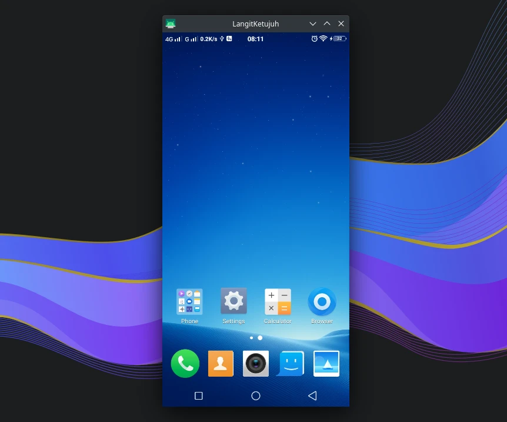

# Scrcpy mirroring

## Deskripsi

`scrcpy` berguna untuk melihat dan mengontrol perangkat dengan pencerminan layar perangkat smartphone ke layar monitor desktop.



## Cara memasang

```sh
doas xbps-install android-udev-rules android-tools scrcpy
```

## Mengaktifkan layanan adb

Pastikan layanan adb sudah aktif. Cek dengan perintah ini:

```sh
doas vsv status adb
```

Apabila bewarna hijau dengan label `run` maka adb sedang berjalan. Jika belum berjalan, maka aktifkan dengan perintah ini:

```sh
doas ln -s /etc/sv/adb /var/service/
```

## Aktifkan usb debug di android smartphone

Setiap perangkat Android memiliki pengaturan yang berbeda-beda tergantung mereknya. Tetapi biasanya masuk di pengaturan developer.

- More Options
- Developer `Options`.
- Aktifkan `USB Debugging`.

## Menjalankan `scrcpy`

Kemudian jalankan `scrcpy` melalui konsole terminal atau krunner (Alt+F2).
