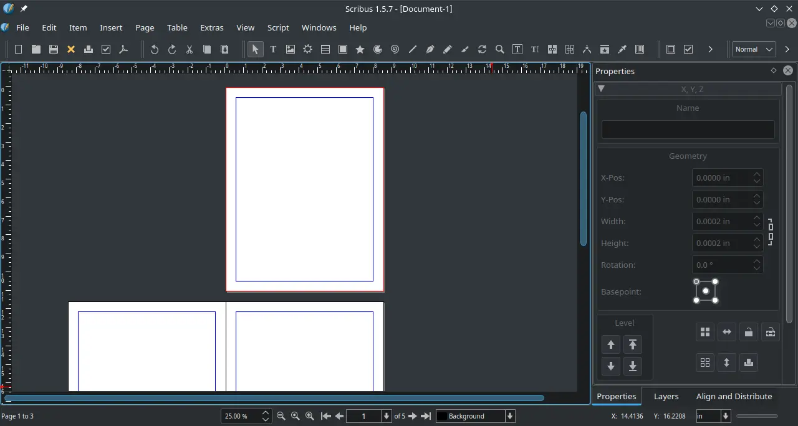

# Scribus

## Deskripsi

[Scribus](https://www.scribus.net/) merupakan perangkat lunak yang digunakan untuk penerbitan rancangan tata letak pada buku, brosur, poster, kalender, majalah dan bahkan dapat digunakan untuk perindustrian manufaktur. Scribus lebih dikenal sebagai DTP (_desktop publishing_) sebagai keperluan layout halaman profesional. Dari sekian banyaknya perangkat lunak DTP, dapat dikatakan scribus sebagai satu-satunya DTP yang dapat didapatkan secara cuma-cuma.

Scribus dirancang sebagai alat bantu tata letak yang fleksibel, mudah digunakan dan menawarkan profil warna. Profil warna tersebut antara lain:

- RGB, sRGB display profile (ICC V2.2)
- CMYK, ISO Coated v2 300% (basiCColor)

Secara bawaan, scribus di sistem operasi LangitKetujuh sudah terpasang ghostscript sehingga scribus dapat berjalan dengan semestinya, baik untuk ekspor ke PDF maupun Postscript.

## Dokumentasi

Pengguna dapat mempelajari scribus di [halaman wiki](https://wiki.scribus.net/) yang telah disediakan.
