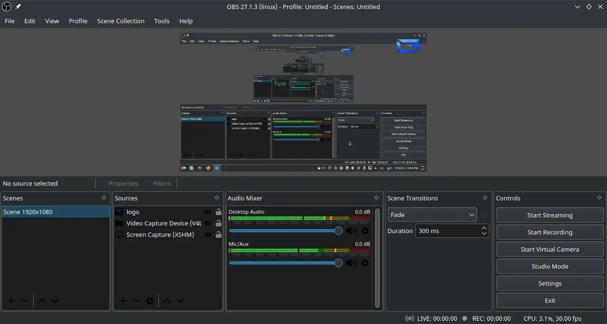

# OBS Studio

## Deskripsi

[OBS Studio](https://obsproject.com/) (Open Broadcaster Software) merupakan perangkat lunak yang digunakan untuk _broadcast_, _streaming_ dan perekaman video. Tersedia dalam platform GNU/Linux, Windows, macOS. Ada beberapa fitur menarik yang disajikan oleh OBS Studio. Performa yang tinggi dalam pengambilan audio dan video serta penggabungan antara keduanya. Terlebih lagi ada fitur multi _source_ untuk membuat profil dari jendela (window), pengambilan video, gambar, teks, webcam, virtual camera dan sebagainya. OBS Studio memiliki fitur yang tidak kalah penting, yaitu sebagai perangkat lunak _live streaming_ yang ringan dengan berbagai layanan platform.

LangitKetujuh juga mengikutsertakan v4l2loopback untuk secara bawaan agar pengguna dapat mengaktifkan fitur virtual kamera (Video Source). Setiap adegan (scene) di OBS tidak ada batas, pengguna dapat membuat adegan yang sesuai dengan kebutuhannya. Menariknya ada beberapa efek untuk perpindahan/transisi adegan.

OBS Studio juga memiliki kontrol audio yang intuitif, penyaringan audio dengan noise gate dan noise suppression untuk mengurangi bercak audio (suara semut). Bahkan pengguna dapat mengendalikan sepenuhnya dengan program tambahan VST.

## Dokumentasi

OBS Studio dibuat dengan sesederhana mungkin agar mudah digunakan. Pengguna dapat mempelajari fitur lebih lanjut di [wiki](https://obsproject.com/wiki/) yang telah disediakan.
