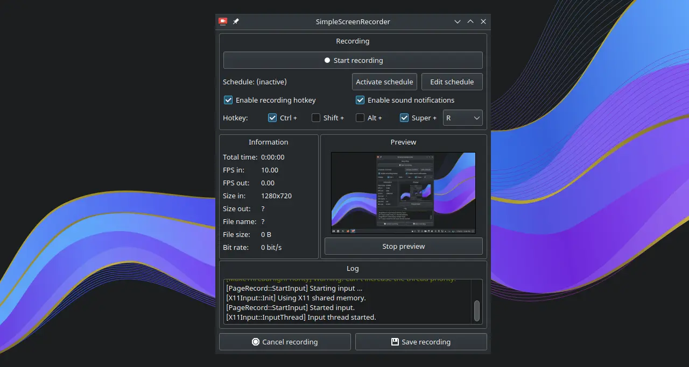
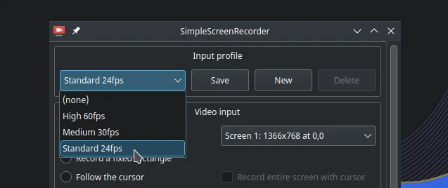
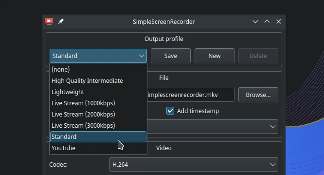

# Simple screen recorder

## Deskripsi

[SSR](https://www.maartenbaert.be/simplescreenrecorder/) adalah perangkat lunak perekam desktop. SSR memiliki beberapa kontainer codec yang dihasilkan, yaitu MKV, MP4, WebM dan OGG. Penggunaan SSR tergolong cukup mudah, karena pengguna hanya mengikuti alur dari tahap antarmuka SSR.

SSR di sistem operasi LangitKetujuh menambahkan `l7-ssr` untuk profil masukan dan keluaran, seperti macam-macam fps dan keluaran kontainer.

Input:
- Standard 24fps
- Medium 30fps
- High 60fps

Output:
- Standard (MKV)
- Lighweight (WebM)

