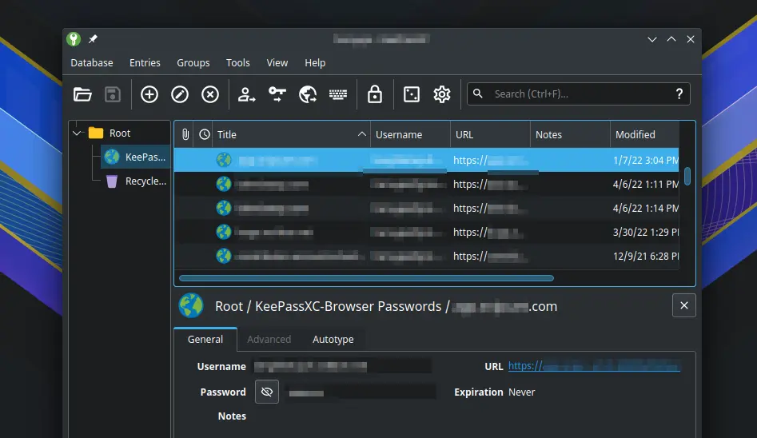
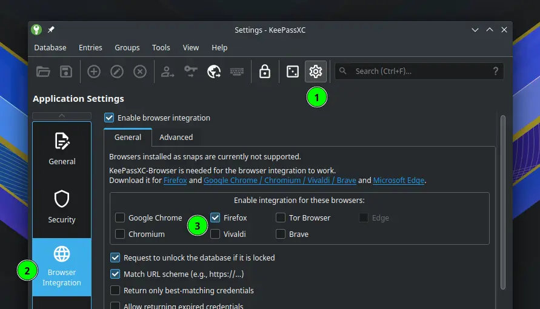
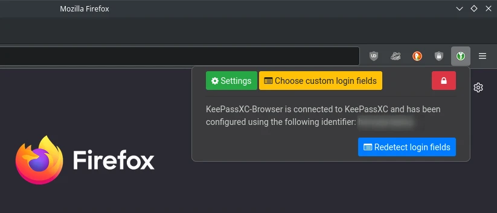
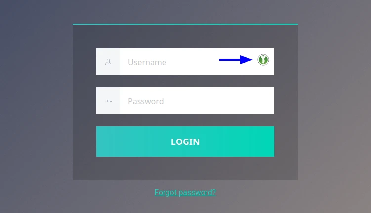

# KeePassXC

[KeePassXC](https://keepassxc.org/) merupakan perangkat lunak yang digunakan untuk menyimpan data dan kata sandi pengguna ketika menjelajahi dengan web browser. Benefitnya yaitu pengguna dapat menyimpan data sensitifnya sendiri tanpa disimpan di web browser. Dan basis data tersebut tentunya telah terenkripsi.



## Cara pemasangan

```
doas xbps-install keepassxc l7-keepassxc
```

Gunakan konfigurasi tambahan.

```
cp -rfv /etc/skel/.config/keepassxc/ ~/.config/
cp -ffv /etc/skel/.config/autostart/org.keepassxc.KeePassXC.desktop ~/.config/autostart/
```

## Pengaturan awal

- Untuk pertama kali, buatlah database baru lalu simpan di direktori yang diinginkan.
    - Klik `Create new database`.
    - Database name: `Passwords`, klik continue.
    - Enkripsi seting, klik continue.
    - Database credentials, masukkan kata sandi, klik continue.
    - Pilih lokasi penyimpanan berkas database, klik continue.
- Agar berjalan dengan semestinya di browser, maka pasanglah ekstensi tambahan di browser.
    - [Firefox](https://addons.mozilla.org/firefox/addon/keepassxc-browser/)
    - [Chrome, chromium, vivaldi, brave](https://chrome.google.com/webstore/detail/keepassxc-browser/oboonakemofpalcgghocfoadofidjkkk)
    
    - Buka browser, klik bagian addons keepassxc.
    - Klik `Setting` > `Connected Databases` > klik `Connect`. Akan muncul dialog, isikan nama komputer misalnya `studio`.
    
- KeePassXC sudah dapat digunakan. Biasanya ketika menyalakan komputer akan meminta kata sandi keepassxc untuk mengambil data dari database.
- Setiap halaman dengan inbox nama pengguna dan kata sandi akan terlihat ikon keepassxc.

- Pengguna akan melihat notifikasi menambahkan data baru (new/update) di browser bagian atas.
