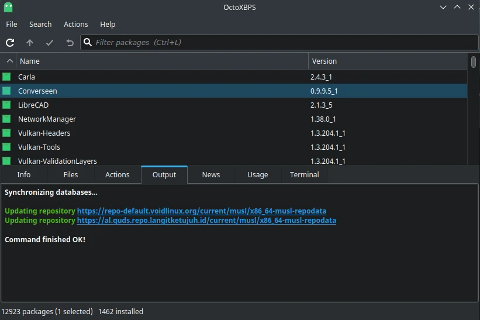

# OctoXBPS

## Deskripsi

Perangkat lunak berbasis Qt5 untuk memasang dan menghapus paket dengan tampilan visual GUI, sehingga memudahkan pengguna dalam mengelola paketnya. Selain itu, pengguna juga dapat melihat informasi dan daftar isi berkas dari paket yang dipilih serta menghapus cache paket yang telah kedaluwarsa.



Di LangitKetujuh sendiri dengan paket `l7-octoxbps` sudah menonaktifkan pencarian instan (instant search) agar tidak terjeda saat melakukan pencarian.

## Cara memasang

```sh
doas xbps-install -Sy {,l7-}octoxbps
cp -rfv /etc/skel/.config/octoxbps/ ~/.config/
```

## Penggunaan

Ada beberapa warna sebagai tanda informasi paket.

- 📃 (putih) = Tidak terpasang.
- 📗 (hijau) = Sudah terpasang.
- 📕 (merah) = Memerlukan pembaruan.

Sedangkan cara penggunaannya sebagai berikut.

- Seleksi paket yang diinginkan.
- Klik kanan, pilih `Install` untuk memasang, `Remove` untuk menghapus.
- Klik ikon ceklis (ctrl+m) untuk mengeksekusinya, atau membatalkannya (ctrl+e).

<!--## Eksekusi sh

Biasanya octoxbps memerlukan kata sandi untuk sinkronisasi. Hal ini dikarenakan octoxbps membutuhkan eksekusi `sh` dengan pengguna root. Dengan demikian, sebagai pengguna dalam kategori wheel (administrator) agar dapat menjalankan octoxbps tanpa kata sandi, maka berikan akses tanpa kata sandi untuk `sh` di sudoers dengan menjalankan perintah dibawah ini (sekali saja).

```sh
doas sh -c "echo '%wheel ALL=(ALL) NOPASSWD: /bin/sh' >> /etc/sudoers"
```

Untuk versi rilis setelah `20210921`, perintah tersebut sudah terkonfigurasi.-->
