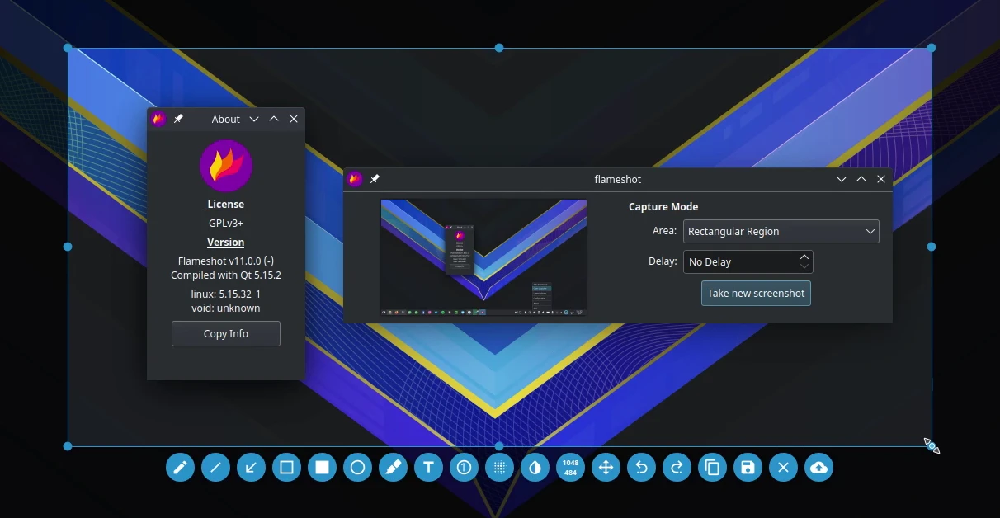
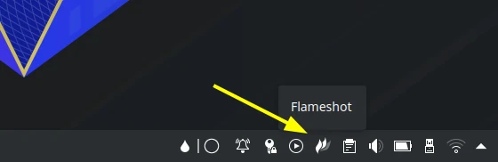

# Flameshot

## Deskripsi

[Flameshot] merupakan perangkat lunak untuk mengambil gambar layar monitor dengan menambahkan fitur editing yang sederhana tetapi sangat efektif. Seperti menambahkan persegi, lingkaran, arah panah, garis, efek pixelate dan blur, upload ke penyedia gambar dan lain-lain.



## Cara memasang

```
get flameshot l7-flameshot
```

Gunakan pengaturan tambahan.

```
cp -rfv /etc/skel/.config/flameshot/ ~/.config/
```

Konfigurasi tersebut berisi pengaturan:
- Warna UI diganti agar senada dengan warna utama LangitKetujuh OS.
- Keluaran nama berkas `Screenshot_%Y%m%d_%H%M%S.png` sama seperti nama berkas spectacle.
- Berjalan otomatis saat awal booting.
- Menonaktifkan cek update.

Pengguna dapat menggunakan [Flameshot] dengan langsung mengklik ikon dibagian panel kanan bawah.



## Pintasan

- `Klik kiri` = Menyeleksi area pengambil gambar.
- `Klik kanan` = Menampilkan pengambil warna.
- `Ctrl+s` = Menyimpan hasil seleksi.
- `Ctrl+c` = Menyalin hasil seleksi.
- `Scroll` = Mengganti nilai ketebalan garis/efek.
- `Spasi` = Menampilkan pengaturan.
- `Esc` = Keluar.

[Flameshot]:https://flameshot.org/
