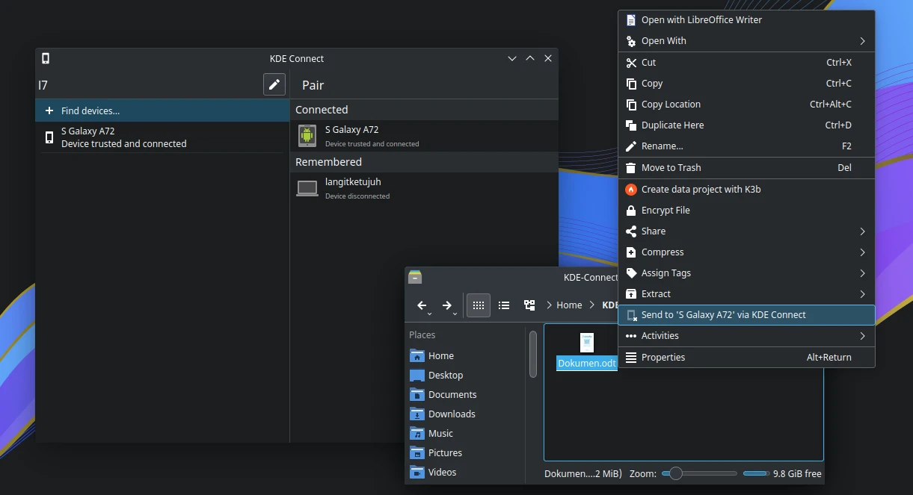

# KDE Connect

## Deskripsi

Banyak fitur yang luar biasa dari kde-connect. Tidak hanya berbagi berkas saja, tetapi bisa untuk mengontrol presentasi, multimedia (audio, video, dan volume), mengontrol input, membuka sms melalui kde-connect sms dan menjalankan perintah-perintah tertentu. Tentu, kde-connect adalah perangkat lunak yang bebas iklan.

## Pemasangan

- Unduh aplikasi kde-connect di <a href="https://f-droid.org/en/packages/org.kde.kdeconnect_tp/" target="_blank">F-Droid</a> atau di <a href="https://play.google.com/store/apps/details?id=org.kde.kdeconnect_tp" target="_blank">PlayStore</a>.
- Jika menggunakan wifi, gunakan jaringan yang sama. Tetapi jika tidak ada jaringan wifi, aktifkan hotspot smartphone. kemudian aktifkan wifi laptop/PC lalu sambungkan ke smartphone.
- Buka aplikasi kde-connect di laptop/pc dan di smartphone.

## Penggunaan

- Melalui smartphone:
  - Buka kde-connect di smartphone.
  - Pilih nama device laptop/PC. Misalnya `L7`.
  - Pilih `Request Pairing`.
  - Di laptop/PC akan muncul notifikasi. Pilih `Accept`.
  - Sekarang dapat menggunakan kde-connect di smartphone. Misalnya mengirim berkas dengan klik `Send file`. pilih berkasnya. Berkas tersebut akan terkirim ke laptop/pc di folder `Downloads`.

- Melalui laptop/PC:
  - Buka kde connect di laptop/PC.
  - Klik `Find Devices`.
  - Pilih nama perangkat smartphonesnya. Misalnya `Android`.
  - Klik `Pair`.
  - Di smartphone akan muncul notifikasi `tap to answer`. Klik `Accept`.
  - Sekarang dapat menggunakan kde-connect di laptop/PC. Misalnya mengirim berkas dengan klik kanan, pilih `Send to NamaSmartphone`. Berkas tersebut akan terkirim ke smartphone di folder `Downloads`.
