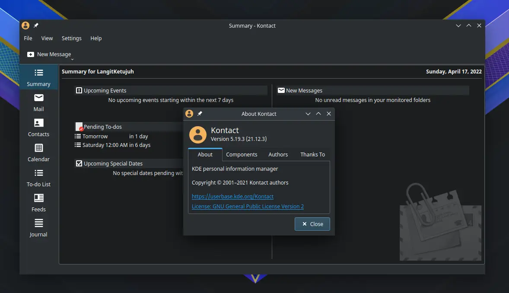
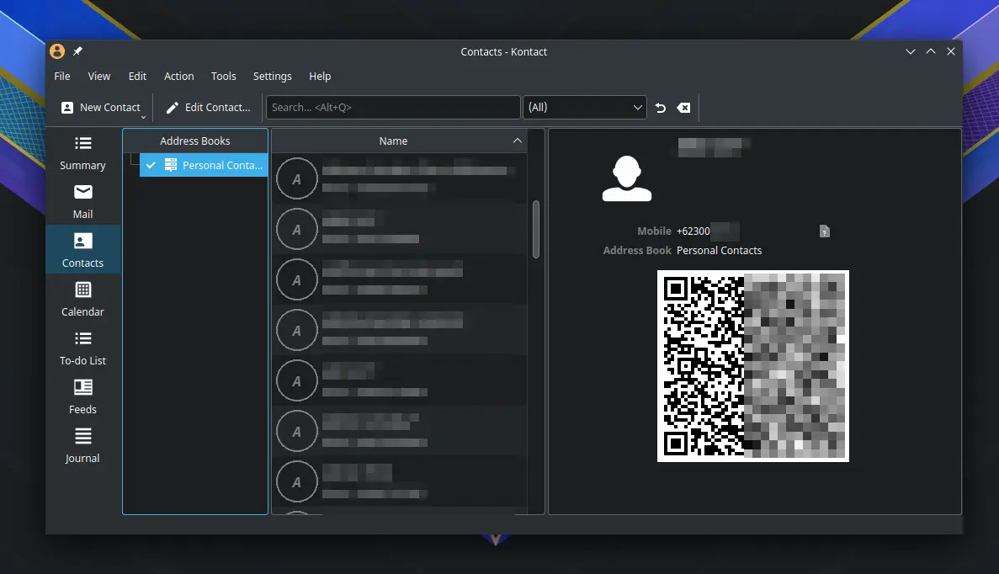
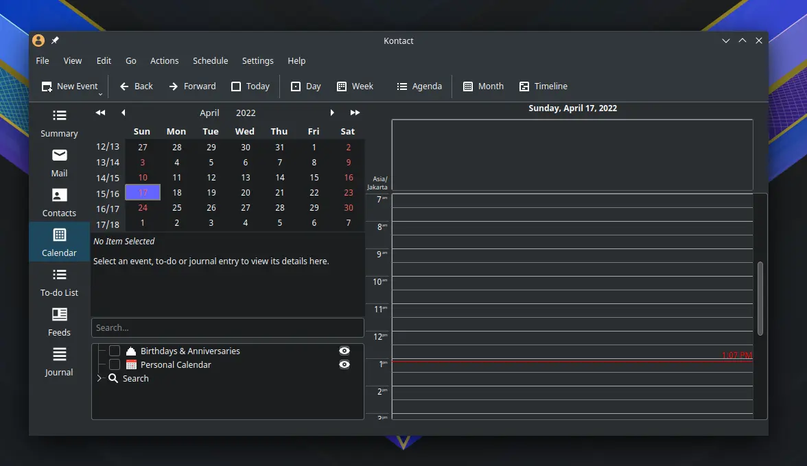
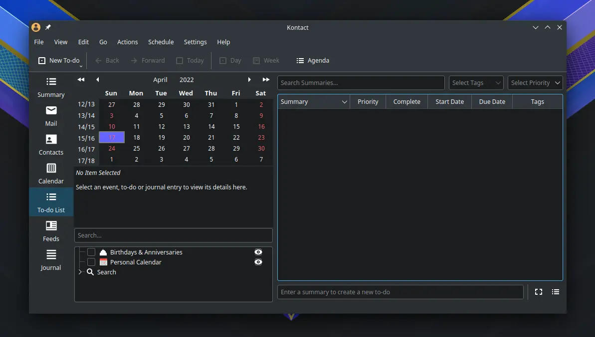
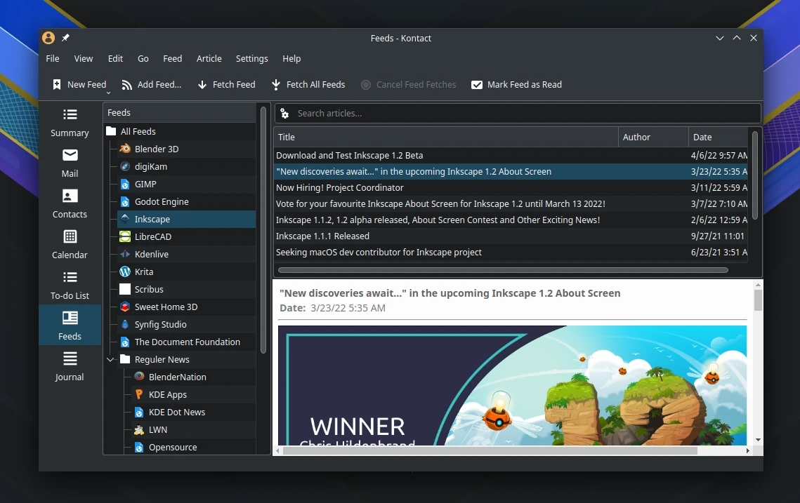

# Kontact

## Deskripsi

[Kontact] merupakan perangkat lunak bebas untuk manajemen personal informasi (PIM) yang terintegrasi dengan perangkat lunak KDE lainnya. Seperti KMail, KAddressBook, KOrganizer, dan Agregrator. Tujuannya untuk memudahkan pengelolaan surel dan informasi kontak dalam satu jendela saja.



## Cara memasang

```
get kontact korganizer kmail kaddressbook akregator kdepim-addons
```

Pasang konfigurasi tambahan.

```
get l7-kmail l7-korganizer l7-akregator
cp -rfv /etc/skel/.config/{kmail2rc,korgacrc,akregatorrc} ~/.config/
cp -rfv /etc/skel/.local/share/akregator/ ~/.local/share/
```

Konfigurasi tersebut yaitu menambahkan beberapa pengaturan dasar:
- Mengaktifkan anti iklan di KMail.
- Mengaktifkan gambar `auto resize` di email.
- Mengaktifkan systray di panel.
- Mode membaca email disebelah kanan.
- Mengaktifkan **batal kirim** email selama 10 detik pertama.
- Mengaktifkan autostart untuk KOrganizer.
- Memperbesar ukuran font untuk akregator.
- Menambahkan daftar feed yang relevan.

## Integrasi aplikasi

[KMail] memiliki fungsi sebagai email klien yang mendukung POP3 dan IMAP. Seperti gmail, yahoo, outlook dan sebagainya. Pengguna dapat langsung menggunakannya dengan memilih tab **Mail**, lalu masuk ke menu `Settings` > pilih `Add Account` untuk menambahkan akun baru.


[KAddressBook] memudahkan memanajemen kontak dengan mudah, misalnya mengirim ajakan pertemuan atau rapat dengan email kontak yang sudah dimasukkan sebelumnya.



[KOrganizer] memiliki fungsi untuk mengatur kalender, penjadwalan, jurnal dan event.



[Korganizer] juga mendukung perkakas todo untuk membuat perencanaan dan merancang daftar kerja.



[Akregator] berfungsi untuk membaca dan mendapatkan berita informasi dari feed rss situs favorit, seperti di KDE Dot dan planet KDE.



[Kontact]:https://kontact.kde.org/components/kontact/
[KMail]:https://kontact.kde.org/components/kmail/
[KAddressBook]:https://kontact.kde.org/components/kaddressbook/
[KOrganizer]:https://kontact.kde.org/components/korganizer/
[Akregator]:https://kontact.kde.org/components/akregator/
