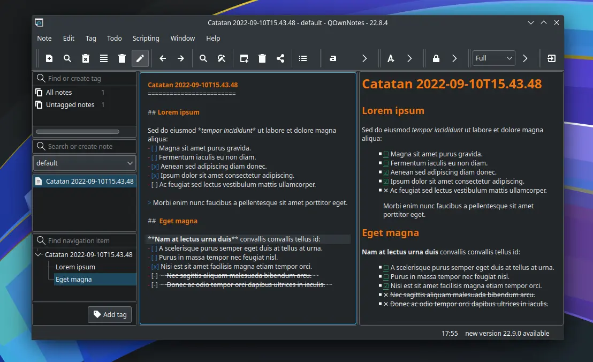
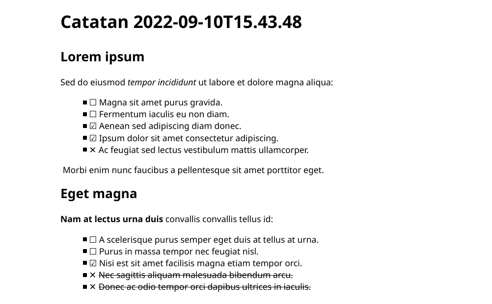

# QOwnNotes

## Deskripsi

[QOwnNotes] merupakan perangkat lunak untuk membuat catatan instan yang mendukung dengan format markdown. Catatan tentang ide, daftar, karangan dan tulisan sederhana dapat ditulis di QOwnNotes. Bahkan tersedia fitur tag untuk mengkategorikan setiap catatan. Tentunya dengan membuat catatan, pengguna akan terlatih untuk memperbaiki cara penulisannya dan mempertajam daya ingat.



Hasil dari catatan dapat diekspor ke `.md`, `.pdf`, dan `.html`. Serta terintegrasi dengan layanan [Nextcloud] dan [Owncloud].




## Cara memasang

```
get qownnotes l7-qownnotes
```

Gunakan pengaturan tambahan.

```
cp -rfv /etc/skel/.config/PBE ~/.config/
```

Konfigurasi tersebut berisi pengaturan:
- Menggunakan warna gelap native bawaan tema.
- Menggunakan ikon native bawaan tema.
- Menggunakan layout Full.

## Dokumentasi

Meskipun QOwnNotes terdapat tool untuk mengatur format teks, pengguna juga dapat belajar menggunakan markdown dengan [cheatsheet](https://www.qownnotes.org/getting-started/markdown.html) agar lebih maksimal.

[QOwnNotes]:https://www.qownnotes.org
[Nextcloud]:https://nextcloud.com
[Owncloud]:https://owncloud.com
