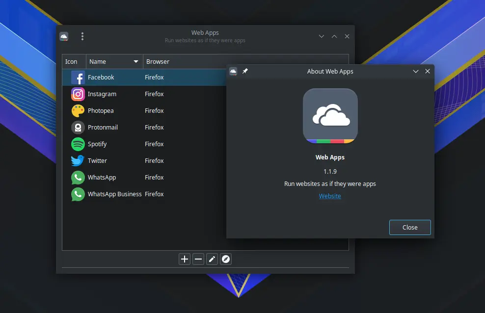
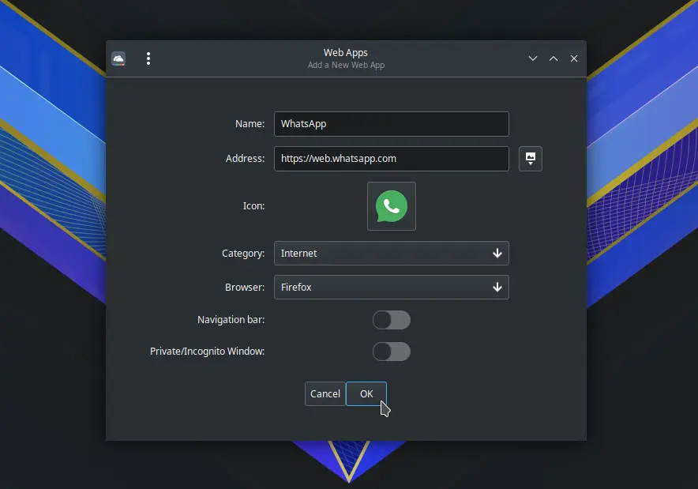
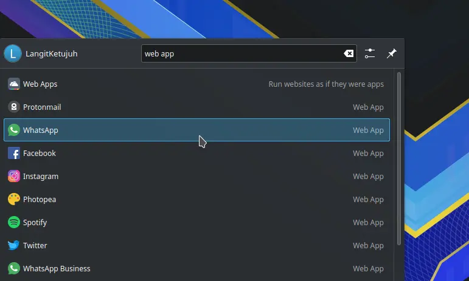
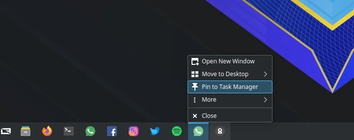

# Web Apps Manager

## Deskripsi

[Web Apps Manager] atau yang disebut dengan `webapp-manager` adalah perangkat lunak yang digunakan untuk membuat web aplikasi seperti native dengan dukungan browser. Tujuannya lainnya untuk membuat pintasan web aplikasi dengan profil terisolasi. Seperti membuat web aplikasi WhatsApp, Facebook, Reddit, Instagram, Twitter dan lain sebagainya.



## Cara memasang

Cara memasangnya buka di konsole atau melalui [OctoXBPS].

```sh
get webapp-manager
```

## Cara penggunaan

- Klik ikon `+`
- Masukkan nama web aplikasi. Misalnya `WhatsApp`
- Masukkan nama url web. Misalnya `https://web.whatsapp.com`
- Pilih ikon.
- Pilih browser, misalnya `Firefox`.
- Klik OK.



- Pengguna dapat menemukan web aplikasi yang telah dibuat di menu.



- Agar lebih mudah diakses, web aplikasi dapat dipin ke panel task manager.



## Contoh web aplikasi

1. Facebook
    - Name: `Facebook`
    - Address: `https://facebook.com`
    - Icon: `facebook`
    - Category: `Internet`

2. Instagram
    - Name: `Instagram`
    - Address: `https://instagram.com`
    - Icon: `instagram`
    - Category: `Internet`

3. Twitter
    - Name: `Twitter`
    - Address: `https://twitter.com`
    - Icon: `twitter`
    - Category: `Internet`

4. Spotify
    - Name: `Spotify`
    - Address: `https://open.spotify.com`
    - Icon: `spotify`
    - Category: `Internet`

5. WhatsApp
    - Name: `WhatsApp`
    - Address: `https://web.whatsapp.com/`
    - Icon: `whatsapp`
    - Category: `Internet`

6. Youtube Music
    - Name: `Youtube Music`
    - Address: `https://music.youtube.com/`
    - Icon: `youtube`
    - Category: `Internet`

[Web Apps Manager]:https://github.com/linuxmint/webapp-manager
[OctoXBPS]:../perkakas/octoxbps.md
