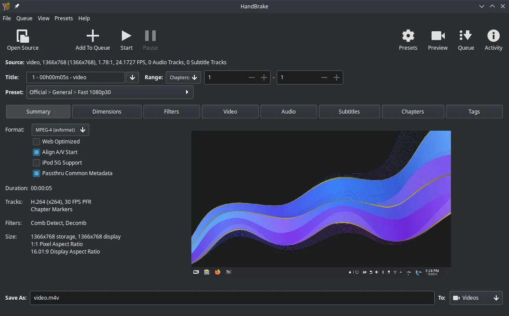

# HandBrake

## Deskripsi

[HandBrake] merupakan perangkat lunak untuk memodifikasi codec dalam video, seperti mengganti kualitas fps, kontainer yang digunakan, dan codec yang disesuaikan dengan perangkat tertentu.

[HandBrake] dioptimalkan dengan profil perangkat yang pengguna butuhkan, memilih profil yang umum yang standar atau dengan kualitas konversi yang tinggi. Hal ini memungkinkan untuk transformasi codec semakin mudah dan cepat tanpa perlu mengatur konfigurasi khusus.



Beberapa keluaran codec yang dihasilkan dari HandBrake:
- Berkas kontainer: .MP4(.M4V), .MKV dan WebM.
- Video Encoder: H.264 dan H.265 (termasuk dukungan akselerasi hardware), MPEG-4 dan MPEG-2, VP8, VP9 dan Theora.
- Audio Encoder: AAC / HE-AAC, MP3, FLAC, AC3, E-AC3, Opus dan Vorbis.
- Audio Pass-thru: AC-3, E-AC3, FLAC, DTS, DTS-HD, TrueHD, AAC, MP3 dan MP2 tracks.

## Cara memasang

```sh
get handbrake
```

## Dokumentasi

Pengguna dapat mempelajari [HandBrake] lebih lanjut di halaman [dokumentasi] yang telah disediakan.

[HandBrake]:https://handbrake.fr/
[dokumentasi]:https://handbrake.fr/docs
