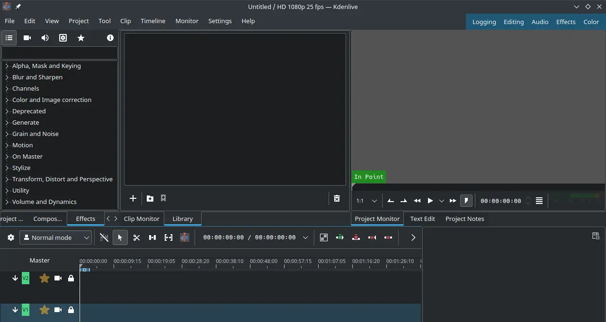

# Kdenlive

## Deskripsi

[Kdenlive] merupakan perangkat lunak terbuka untuk menyunting video. Dibangun dengan pustaka Qt dan KDE framework. Kebanyakan dari pemroses video di [Kdenlive] menggunakan MLT framework yang bergantung dengan FFmpeg, frei0r, movit, ladspa, sox dan lainnya.

[Kdenlive] dirancang untuk memenuhi kebutuhan video editor dari dasar hingga ke pekerjaan profesional. Banyak fitur yang disediakan oleh kdenlive, misalnya multi-track video editor untuk memasukkan aset audio dan video ke dalam track secara bersamaan, mendukung berbagai format audio dan video yang didukung dengan pustaka FFmpeg, antarmuka dan pintasan papan ketik yang mudah diganti sesuai yang dibutuhkan, berbagai macam efek dan transisi, dan sebagainya.

[Kdenlive] memang sangat direkomendasikan untuk pengguna yang memiliki kreatifitas dalam bidang konten kreator.



## Cara memasang

```sh
get kdenlive
```

## Dokumentasi

Pengguna dapat menjelajahi setiap fitur dan mempelajari [Kdenlive] di halaman [dokumentasi].

[Kdenlive]:https://kdenlive.org/en/
[dokumentasi]:https://docs.kdenlive.org/
