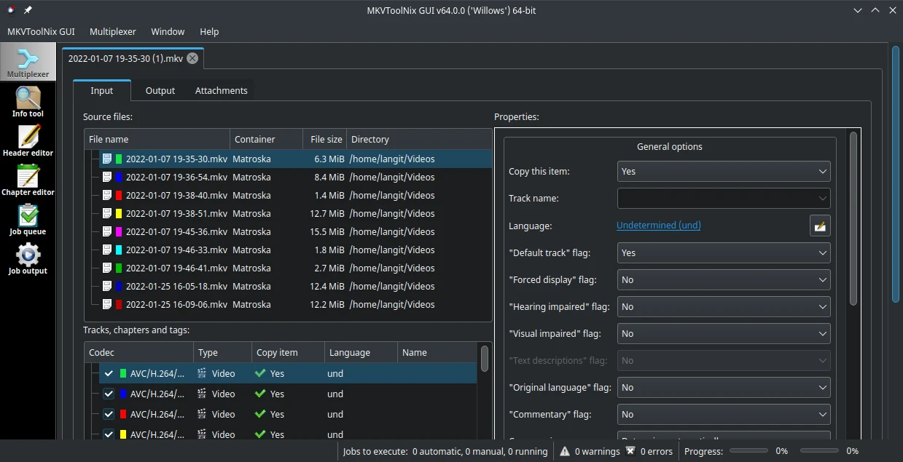

# MKVToolkit

## Deskripsi

[MKVToolkit](https://mkvtoolnix.download/) merupakan perangkat lunak terbuka untuk mengubah, memisahkan dan memeriksa berkas MKV. Banyak dukungan format keluaran yang dihasilkan, seperti AVI, WMV, OGG, SRT, MP3, MP4, RMV, atau USF. Selama berkas yang diubah adalah MKV, pengguna dapat menambah atau menghapus subtitle pada video.



## Cara memasang

```sh
doas xbps-install -Sy mkvtoolnix-gui
```

## Dokumentasi

Pengguna dapat menjelajahi setiap fitur dan panduan mkvtoolkit di [dokumentasi](https://mkvtoolnix.download/docs.html) yang tersedia.
