# Virt Manager

## Deskripsi

[Virtual Manager] merupakan perangkat lunak untuk mengatur virtualisasi secara mudah dengan GUI. Teknologi virtualisasi menggunakan KVM (Kernel Vital Machine) di kernel linux.

## Cara memasang

```sh
get virt-manager virt-manager-tools qemu
```

## Tambahkan pengguna ke grup kvm

```sh
doas gpasswd -a "$USER" libvirt
doas usermod -aG kvm "$USER"
```

Modprobe untuk mesin 32-bit (i686)

```sh
modprobe kvm-intel  # untuk Intel CPUs
modprobe kvm-amd    # untuk AMD CPUs
```

## Mengaktifkan layanan virtualisasi

```sh
rsv enable libvirtd
rsv enable virtlockd
rsv enable virtlogd
```

Gunakan rsv untuk melihat layanan yang berjalan.

```sh
rsv status libvirtd
rsv status virtlockd
rsv status virtlogd
```

Contoh keluarannya seperti berikut ini.

```sh
➜  ~ rsv status virt
run: libvirtd: (pid 17454) 843s
run: virtlockd: (pid 803) 19395s
run: virtlogd: (pid 806) 19395s
```

Pemasangan [Virtual Manager] sudah selesai.

## Penggunaan Virt Manager

Buka "Virtual Machine Manager" di menu.

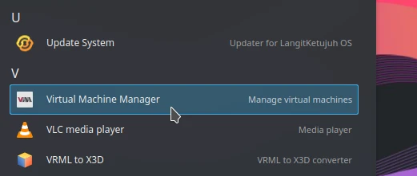

Tambahkan mesin virtual baru.

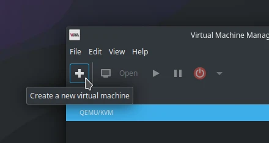

Pilih lokal install. Klik _Forward_ untuk melanjutkan.

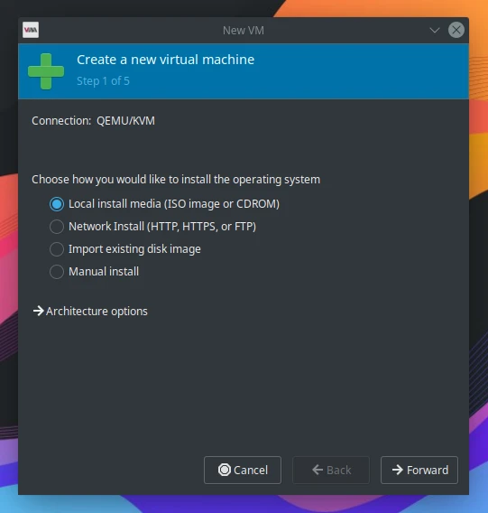

Hapus ceklis _Automatic detect_. Pilih "Voidlinux" sebagai sistem operasinya.

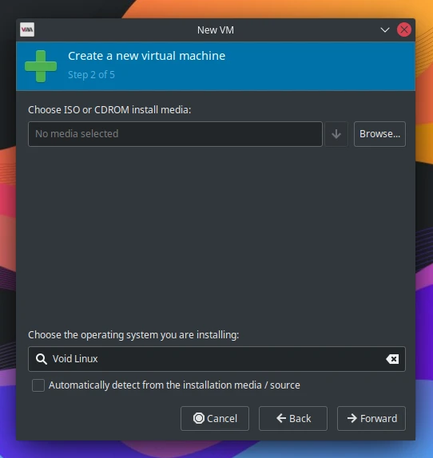

Klik _Browse_. Lalu muncul dialog untuk membuat virtual disk. Klik _Browse Local_. Pilih ISO yang dikehendaki.

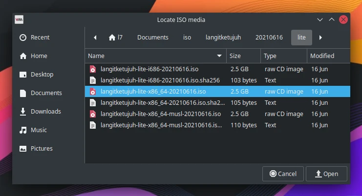

Klik _Forward_ untuk melanjutkan.

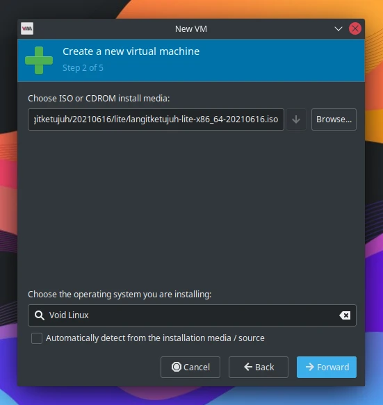

Jika ada peringatan akses alamat _permission_ seperti ini. Pilih `Yes` saja.

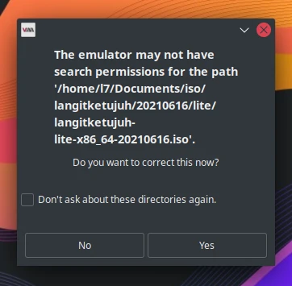

Isikan memori yang dikehendaki, misalnya `2000` Mib (2Gib). Isikan jumlah CPU yang tersedia, misalnya `2` CPU. Klik _Forward_ untuk melanjutkan.

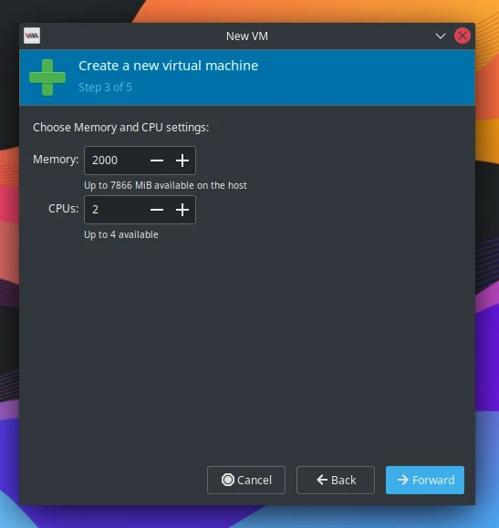

Isikan jumlah penyimpanan mesin virtual. Misalnya `30` GiB. Klik _Forward_ untuk melanjutkan.

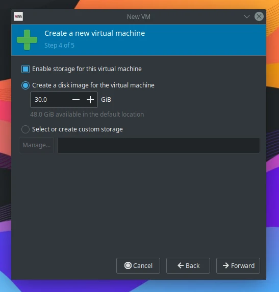

Berikan nama mesin virtualnya. `langitketujuh` sebagai contoh. Klik `Finish` untuk melanjutkan.

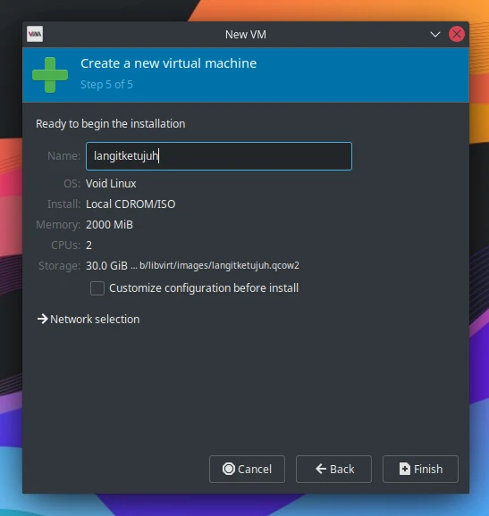

Proses booting sedang berjalan hingga masuk ke desktop mesin virtual. Selesai.

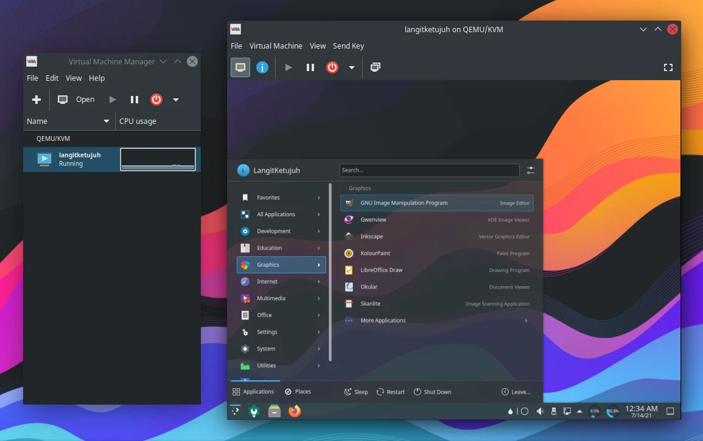

Dikarenakan [Virtual Manager] menggunakan KVM di kernel linux, maka proses layanan cenderung lebih ringan dari pada mesin virtual lainnya.

[Virtual Manager]:https://virt-manager.org/
