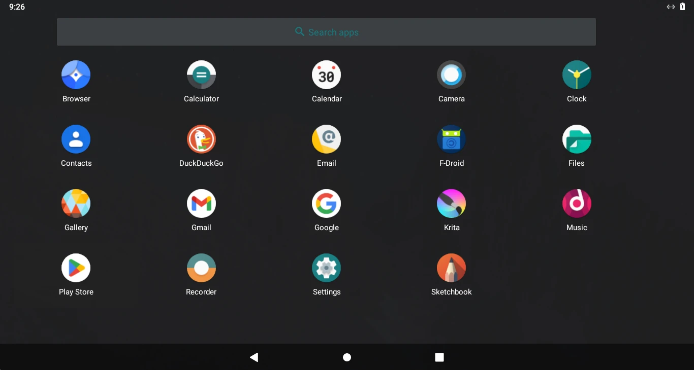
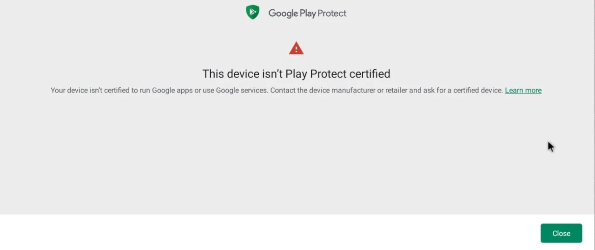
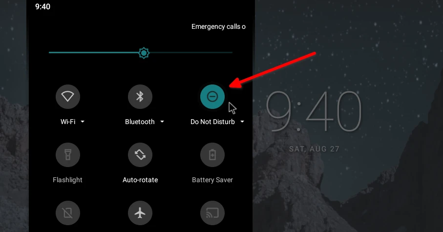

# Waydroid

## Deskripsi

[Waydroid] adalah container yang memungkinkan untuk menjalankan sistem Android (Lineage OS) secara penuh di GNU/Linux. Persyaratan yang harus dipenuhi yaitu pengguna harus menggunakan wayland sesi desktop. Secara bawaan menggunakan sesi X11, selengkapnya dapat merujuk ke tautan [mengganti sesi desktop](../../konfigurasi/kde/sesi-desktop.md#mengganti-sesi-desktop). Kami menyarankan juga untuk menggunakan RAM minimal 4Gib atau diatasnya agar berjalan dengan baik.



## Cara memasang

```
get waydroid python3-pyclip
```

## Mengaktifkan jaringan internet

Dikarenakan LangitKetujuh mengaktifkan layanan `ufw`, maka perlu memberikan akses untuk port yang dibutuhkan waydroid.

```
doas ufw allow 67
doas ufw allow 53
doas ufw default allow FORWARD
```

## Waydroid init

Jalankan waydroid init untuk pertama kalinya. Pilih salah satu, vanilla atau gapps.


- Vanilla

  Versi android ini tidak memiliki aplikasi google.

  ```
  doas waydroid init
  ```

- GAPPS

  Jika ingin memasang waydroid dengan google apps, maka jalankan perintah berikut ini.

  ```
  doas waydroid init -s GAPPS -f
  ```

## Layanan kontainer waydroid

- Mengaktifkan layanan. Untuk pertama kalinya, jalankan layanan waydroid.

  ```
  doas rsv enable waydroid-container
  ```

- Menonaktifkan layanan. Jika waydroid sudah tidak perlu diaktifkan, jalankan perintah ini.

  ```
  doas rsv disable waydroid-container
  ```

## Menjalankan aplikasi

Jalankan waydroid melalui menu. Tunggu beberapa saat hingga tampilan android muncul di desktop. Cepat atau tidaknya tergantung dari spesifikasi komputer.


## Google play protected uncertified (gapps)



Jika pengguna menemukan masalah seperti di atas, hal ini dikarenakan id device tidak terdaftar secara resmi oleh google. Maka ikuti panduan dibawah ini untuk mendaftarkan id perangkat ke google agar dapat login kembali.

Sebelum itu, aktifkan dahulu mode "Do Not Disturb" untuk menonaktifkan notifikasi sementara agar tidak mengganggu.



Kemudian ikuti panduan dibawah ini.

- Pastikan waydroidnya masih berjalan atau belum ditutup. Jika belum berjalan, buka kembali dengan mengklik waydroid di menu.

- Dapatkan id perangkat dengan menjalankan waydroid shell di konsole.

  ```
  doas waydroid shell
  ```

  ```
  ANDROID_RUNTIME_ROOT=/apex/com.android.runtime ANDROID_DATA=/data ANDROID_TZDATA_ROOT=/system/usr/share/zoneinfo ANDROID_I18N_ROOT=/apex/com.android.i18n sqlite3 /data/data/com.google.android.gsf/databases/gservices.db "select * from main where name = \"android_id\";"; exit
  ```

  Hasil keluaran berupa id perangkat seperti dibawah ini:

  ```
  android_id|4456297304XXXXXXXXX
  ```

  Selanjutnya salin kode id: `4456297304XXXXXXXXX` tersebut.

- Buka tautan <https://www.google.com/android/uncertified/> melalui browser di waydroid.

  Masukkan kode id perangkat kedalam _"ID Android Google Service Framework"_ dan klik "Daftar".

  

- Tutup sesi waydroid.

  ```
  waydroid session stop
  ```

  Kemudian buka kembali waydroid di menu. Pengguna dapat login kembali menggunakan google email.

## Memasang _apk_ secara offline

```
doas waydroid app install <aplikasi>.apk
```

Sebagai contoh:

```
doas waydroid app install Downloads/krita.apk
```

[Waydroid]: https://waydro.id
