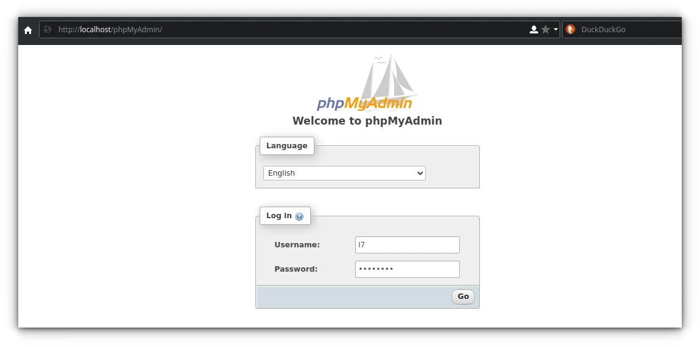

# phpMyAdmin

## Deskripsi

[phpMyAdmin] adalah perangkat lunak bebas yang ditulis dalam bahasa pemrograman PHP yang digunakan untuk menangani administrasi MySQL melalui website WWW (World Wide Web). phpMyAdmin mendukung berbagai operasi MySQL, diantaranya mengelola basis data, tabel-tabel, bidang (fields), relasi (relations), indeks, pengguna (users), perizinan (permissions), dan lain-lain.

## Cara memasang

```
get phpMyAdmin
```

## Symlink

Agar dapat diakses, pindahkan jalur phpMyAdmin ke nginx dengan symlink.

```
doas ln -s /usr/share/webapps/phpMyAdmin /usr/share/nginx/html/phpmyadmin
```

## Restart layanan

```
doas rsv restart nginx
doas rsv restart php-fpm
```

Cek semua layanan.

```
doas rsv status nginx
doas rsv status php-fpm
```

## Konfigurasi kode rahasia blowfish

* Jalankan perintah ini untuk menggenerate kode blowfish 32bit.

    ```
    openssl rand -base64 22
    ```

    Salin (copy) kode tersebut.

* Kemudian buka `config.inc.php`.

    ```
    doas nano /etc/webapps/phpMyAdmin/config.inc.php
    ```

* Tempelkan kode tersebut kedalam `blowfish_secret`.

    `$cfg['blowfish_secret'] = 'xxxxxxxxxxxxxxxxxxxxxxxxxxxxxx==';`.

    Kemudian simpan.

* Simpan dan keluar. (Ctrl+x, Y, Enter)

## Konfigurasi akun pma

* Masuk ke mysql

    ```
    doas mysql -u root -p
    ```

* Ganti `pmapass` dengan sandi rahasia baru, atau samakan dengan sandi `root` anda sebelumnya.

    ```
    CREATE USER 'pma'@'localhost' IDENTIFIED BY 'pmapass';
    ```

* Beri perizinan `phpmyadmin` untuk pengguna `pma`.

    ```
    GRANT SELECT, INSERT, UPDATE, DELETE ON `phpmyadmin`.* TO 'pma'@'localhost';
    FLUSH PRIVILEGES;
    ```

* Ketik `exit` untuk keluar.

## Konfigurasi penyimpanan phpmyadmin

* Buka `config.inc.php`.

    ```
    doas nano /etc/webapps/phpMyAdmin/config.inc.php
    ```

* Hapus titik koma `;` untuk mengaktifkan konfigurasi.

    ```
    /**
     * phpMyAdmin configuration storage settings.
     */

    /* User used to manipulate with storage */
    $cfg['Servers'][$i]['controlhost'] = '';
    $cfg['Servers'][$i]['controlport'] = '';
    $cfg['Servers'][$i]['controluser'] = 'pma';
    $cfg['Servers'][$i]['controlpass'] = 'pmapass';

    /* Storage database and tables */
    $cfg['Servers'][$i]['pmadb'] = 'phpmyadmin';
    $cfg['Servers'][$i]['bookmarktable'] = 'pma__bookmark';
    $cfg['Servers'][$i]['relation'] = 'pma__relation';
    $cfg['Servers'][$i]['table_info'] = 'pma__table_info';
    $cfg['Servers'][$i]['table_coords'] = 'pma__table_coords';
    $cfg['Servers'][$i]['pdf_pages'] = 'pma__pdf_pages';
    $cfg['Servers'][$i]['column_info'] = 'pma__column_info';
    $cfg['Servers'][$i]['history'] = 'pma__history';
    $cfg['Servers'][$i]['table_uiprefs'] = 'pma__table_uiprefs';
    $cfg['Servers'][$i]['tracking'] = 'pma__tracking';
    $cfg['Servers'][$i]['userconfig'] = 'pma__userconfig';
    $cfg['Servers'][$i]['recent'] = 'pma__recent';
    $cfg['Servers'][$i]['favorite'] = 'pma__favorite';
    $cfg['Servers'][$i]['users'] = 'pma__users';
    $cfg['Servers'][$i]['usergroups'] = 'pma__usergroups';
    $cfg['Servers'][$i]['navigationhiding'] = 'pma__navigationhiding';
    $cfg['Servers'][$i]['savedsearches'] = 'pma__savedsearches';
    $cfg['Servers'][$i]['central_columns'] = 'pma__central_columns';
    $cfg['Servers'][$i]['designer_settings'] = 'pma__designer_settings';
    $cfg['Servers'][$i]['export_templates'] = 'pma__export_templates';
    ```

* Simpan. (Ctrl+o, Y, Enter)

## Generate sandi `pmapass`

* Agar lebih aman tidak menulis sandi rahasia secara langsung disuatu berkas, diperlukan meng-_generate_ sandi via PASSWORD mariadb.

    ```
    doas mysql -u root -p
    ```

* Buat sandi baru dengan kata sandi dari root sebelumnya, misalnya `secretpass`.

    ```
    SELECT PASSWORD('secretpass');
    ```

    Hasil keluaran seperti ini:

    ```
    +-------------------------------------------+
    | PASSWORD('secretpass')                    |
    +-------------------------------------------+
    | *9177CC8207174BDBB5ED66B2140C75171283F15D |
    +-------------------------------------------+
    ```

    Maka sandi yang digunakan untuk pmauser adalah `*03E2854B1BC2353C7FED1F780C55F7845322DC57`, kemudian salin kode tersebut.

* Buka kembali `config.inc.php`.

    ```
    doas nano /etc/webapps/phpMyAdmin/config.inc.php
    ```

* Ganti `pmapass` dengan sandi rahasia baru yang telah digenerate sebelumnya.

    `$cfg['Servers'][$i]['controlpass'] = 'pmapass';` menjadi:

    ```
    $cfg['Servers'][$i]['controlpass'] = '*03E2854B1BC2353C7FED1F780C55F7845322DC57'
    ```
* Simpan. (Ctrl+o, Y, Enter)

# Template caching

* Aktifkan template caching di baris terakhir.

    ```
    /**
     * Enable template caching
     */
    $cfg['TempDir'] = '/tmp/phpmyadmin';
    ```

* Simpan dan keluar. (Ctrl+x, Y, Enter)

## Impor basis data phpmyadmin

phpMyadmin memerlukan basis data bawaan untuk menyimpan konfigurasi awal dari `pma`.

```
doas mysql -u root -p < /usr/share/webapps/phpMyAdmin/sql/create_tables.sql
```

## Halaman phpMyAdmin

Pengguna dapat mengaksesnya lelalui <http://localhost/phpmyadmin>



[phpMyAdmin]:https://www.phpmyadmin.net/
