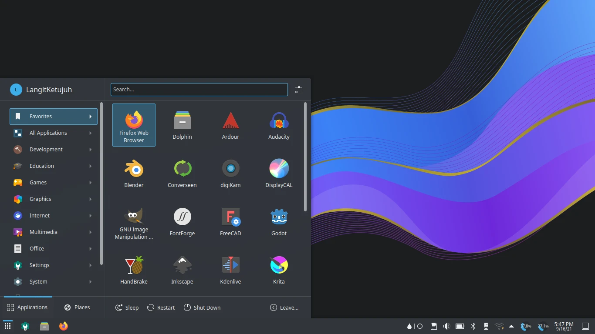

# LangitKetujuh OS

_Bismillahirrohmanirrohim._

**Pilihan Tepat untuk Desainer dan Pengguna Desktop**. Distribusi GNU/Linux untuk desainer, ilustrator, animator, publisher, fotografer, font kreator dan game desainer. Berdasarkan dari [Voidlinux](https://voidlinux.org). Menggunakan [runit init](http://smarden.org/runit/), [KDE Plasma](https://kde.org/plasma-desktop/) lingkungan desktop, pembaruan stabil [rilis bergulir](https://id.wikipedia.org/wiki/Rilis_bergulir) (rolling release) dan sumber daya yang efisien (tersedia [musl libc](https://www.musl-libc.org/)).

Kami telah mengoptimasi pemilihan sistem yang lebih baik dan menyesuaikan aplikasi sesuai kebutuhan spesifik. LangitKetujuh GNU/Linux akan membantu Anda menjadi desainer yang tangguh dengan perangkat lunak terbuka.

* ✨ Website: [https://langitketujuh.id](https://langitketujuh.id)
* 🚀 Telegram: [LangitKetujuh ID](https://t.me/langitketujuh.id)
* 🍄 Instagram: [LangitKetujuh ID](https://instagram.com/langitketujuh.id)
* 🍨 Facebook: [LangitKetujuh ID](https://facebook.com/langitketujuh.id)

> Jika Anda mengakses halaman **Panduan** dengan smartphone, klik menu di pojok kiri atas.
