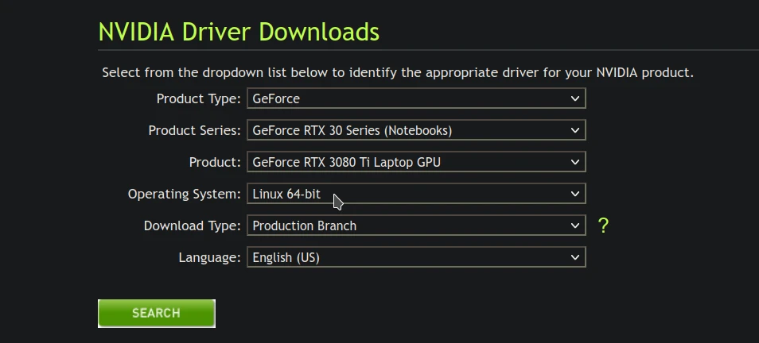
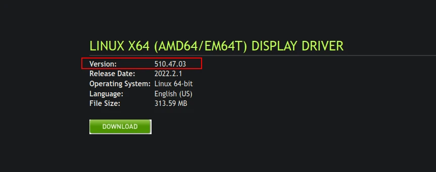

# NVIDIA

## Nouveau

`nouveau` (Open Source Nvidia Driver) di maintenance oleh komunitas dengan dokumentasi yang disediakan oleh Nvidia. Secara bawaan sistem LangitKetujuh sudah memasang driver nouveau.

Cek `driver` kartu grafisnya dengan inxi.

```sh
inxi -G
```
Misalnya `driver:nouveau` maka saat ini kartu grafis yang digunakan adalah nouveau.

## Nvidia

Nvidia (Driver proprietary) hanya bisa dipasang oleh sistem [Glibc](../../../perbandingan/libc.html#glibc-gnu-libc). Sebab driver proprietary tidak bisa diporting ke arsitektur pustaka c lain (seperti musl), kecuali vendornya sendiri yang merilisnya. Secara bawaan LangitKetujuh sudah mengaktifkan repositori tidak bebas namun tidak menambahkan perangkat lunak tidak bebas sama sekali.

Cara memasang Nvidia, periksa dahulu tipe Nvidia.

```sh
inxi -G
```

Pasang repositori [nonfree]. Sebab nvidia merupakan perangkat lunak proprietary (tidak terbuka).

```sh
get void-repo-nonfree
```

Lalu perbarui repodata.

```sh
update
```

Pasang dengan menyesuaikan nomer versi driver kartu grafis.

| **Perintah**    | **Versi**         |
| :-------------- | :---------------- |
| `get nvidia`    | 800 keatas        |
| `get nvidia470` | 600 atau 700      |
| `get nvidia390` | 400 atau 500      |

Jika driver Nvidia yang digunakan termasuk driver [legacy gpu](https://www.nvidia.com/en-us/drivers/unix/legacy-gpu/) maka gunakan `nvidia390` atau `nvidia470`.



Lebih jelasnya pengguna dapat menggunakan [pencarian driver](https://www.nvidia.com/Download/index.aspx?lang=en-us) dengan memilih `Operating System: Linux 64-bit`, tentunya untuk mencari nomer versi saja bukan untuk diunduh. Sedangkan pemasangan driver tetap menggunakan perintah dari tabel diatas.



Dari contoh diatas, Nvidia yang digunakan adalah `nvidia390` sebab menggunakan versi 500 (510.x.x). Hati-hati memilih dan memasang versi driver. Jika salah versi kemungkinannya akan blackscreen, tetapi masalah tersebut dapat diatasi dengan [chroot mode](../../chroot/index.md) dan menghapus drivernya.

## Blacklist nouveau

Tambahkan baris dibawah ini.

```sh
#blacklist nouveau
```
Masukkan ke dalam berkas:

```sh
/etc/modprobe.d/nouveau_blacklist.conf
/usr/lib/modprobe.d/nvidia.conf
/usr/lib/modprobe.d/nvidia-dkms.conf
```

[nonfree]:../../server.html#repo-tembahan
