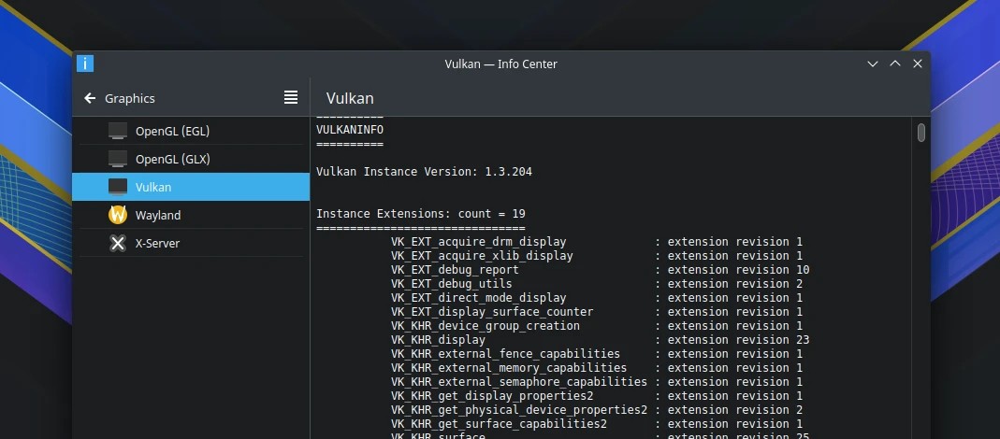

# Vulkan API

## Pemasangan

Vulkan secara bawaan belum terpasang untuk LangitKetujuh versi `20210921` dan sebelumnya, sedangkan versi di selanjutnya sudah terpasang otomatis.

  - AMD/ATI

  ```sh
  doas xbps-install -S Vulkan-Headers Vulkan-Tools Vulkan-ValidationLayers \
  libspa-vulkan mesa-vulkan-overlay-layer vkBasalt mesa-vulkan-radeon vkd3d amdvlk
  ```

  - Intel

  ```sh
  doas xbps-install -S Vulkan-Headers Vulkan-Tools Vulkan-ValidationLayers \
  libspa-vulkan mesa-vulkan-overlay-layer vkBasalt vulkan-loader mesa-vulkan-intel
  ```

## Informasi

Cek informasi vulkan dengan sistem saat ini.

```sh
vulkaninfo
```

Pengguna juga dapat melihat informasi vulkan di `Info Center` > `Graphics` > `Vulkan`



## Vulkan multilib

Jika ingin menambahkan vulkan 32bit khusus untuk arsitektur `x86_64`, aktifkan dahulu repositori multilib `l7-repo-multilib`.

```sh
doas xbps-install l7-repo-multilib
```

Kemudian pasang mesa vulkan-loader dan mesa-vulkan 32bit.

```sh
doas xbps-install -S vulkan-loader-32bit mesa-vulkan-intel-32bit \
mesa-vulkan-radeon-32bit
```
