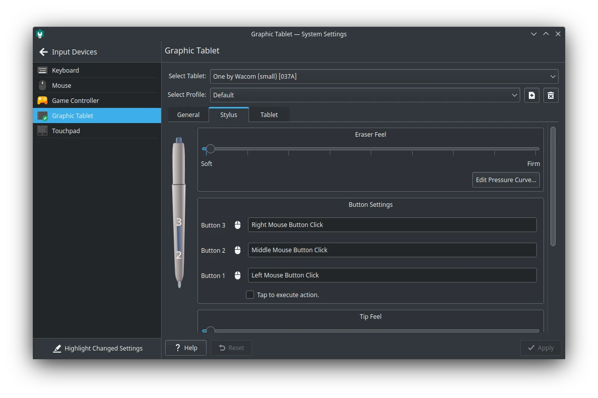

# Pen Tablet

## Wacom Driver

Secara bawaan LangitKetujuh sudah memasukkan driver <a href="https://www.wacom.com" target="_blank">Wacom</a>. Anda hanya perlu menancapkan ke port USB saja. Pen tablet Wacom memiliki fitur lebih, yaitu dapat diintegrasikan langsung dengan pengaturan KDE. Buka bagian `System Settings` > Bagian Hardware `Input Device` > `Graphic Tablet`. Dengan pengaturan tersebut, Anda dapat memodifikasi tombol dan mengatur sensitifitas (pressure) pen tablet.



## Digimend Driver

Beberapa vendor pen tablet memerlukan driver khusus yang menggunakan <a href="http://digimend.github.io" target="_blank">Digimend Driver</a>. Seperti Huion, KYE, Polostar, UC-Logic, UGTizer, Ugee, ViewSonic, Waltop, XP-Pen, dan Yiynova. Untuk mendukung pen tablet tersebut, Anda harus memasangnya dengan menjalankan perintah ini.

```
doas xbps-install -S digimend-kernel-drivers
```

Tipe pen tablet yang didukung oleh Digimend Anda dapat melihatnya di <a href="https://digimend.github.io/tablets" target="_blank">daftar pen tablet Digimend</a>. Namun ada beberapa tipe pen tablet tidak didukung sepenuhnya seperti VEIKK (A30) dan Huion tipe tertentu (G10T & GC610).

Untuk kedepannya, LangitKetujuh diatas versi `20210921` sudah memasukkan Digimend driver.

## Kompatibilitas

Kami menyarankan sebelum menggunakan/membeli produk pen tablet, lebih baik menggunakan pen tablet yang memiliki kompatibilitas yang tinggi. Seperti memilih pen tablet merek wacom yang mudah digunakan, tinggal dicolokkan ke port usb dan langsung tersambung secara otomatis. Terlebih lagi memiliki integrasi dengan pengaturan sistem di KDE Plasma.
