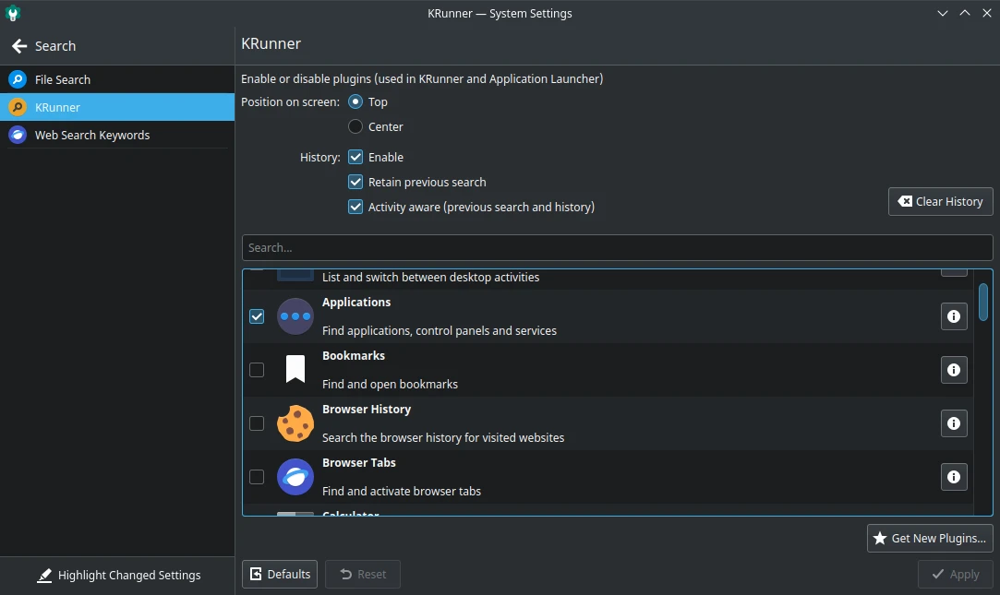

# Krunner Bar

## Mengurangi Addons

Beberapa plugins tambahan di launcher menu KDE Plasma rasanya terlalu banyak, sehingga ketika membuka menu lebih lama munculnya. Agar lebih ringan, solusinya yaitu dengan menonaktifkan plugin tambahan yang tidak diperlukan di pengaturan `Krunner`.

Saran kami dibagian Available Plugins aktifkan 5 plugin saja, antara lain:
- Applications
- Command line
- Kate Sessions
- Plasma Desktop Shell
- System Settings

Dengan berkurangnya plugin tambahan Krunner akan mempercepat durasi buka menu dan menghindari terjadinya galat plasma-shell.
