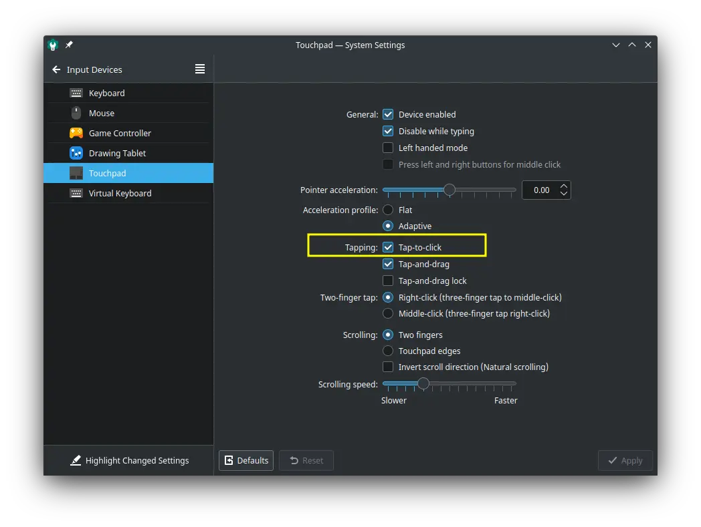
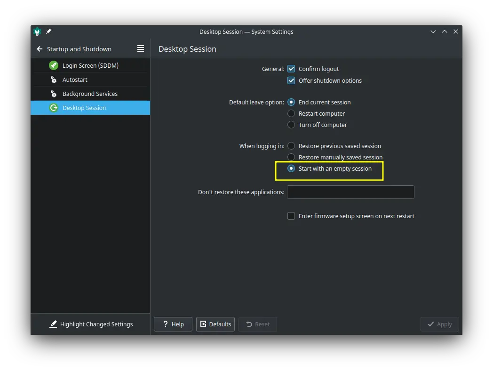
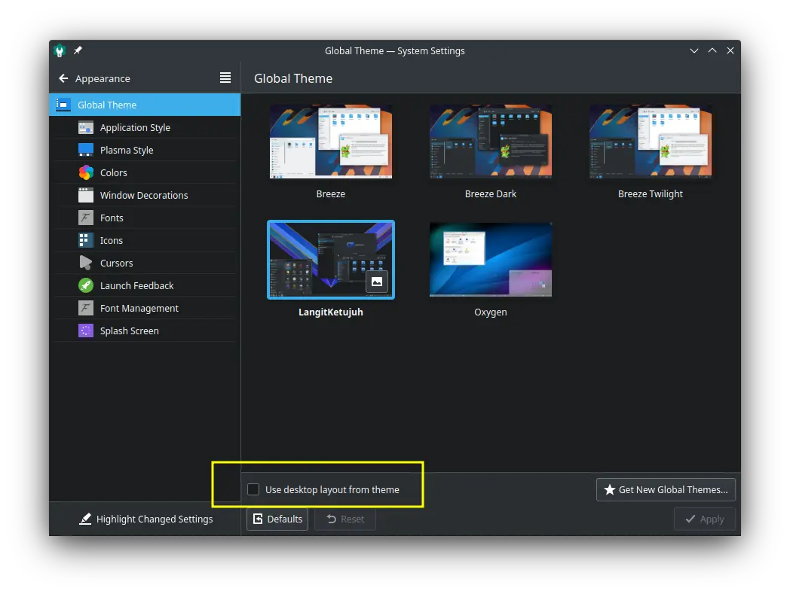
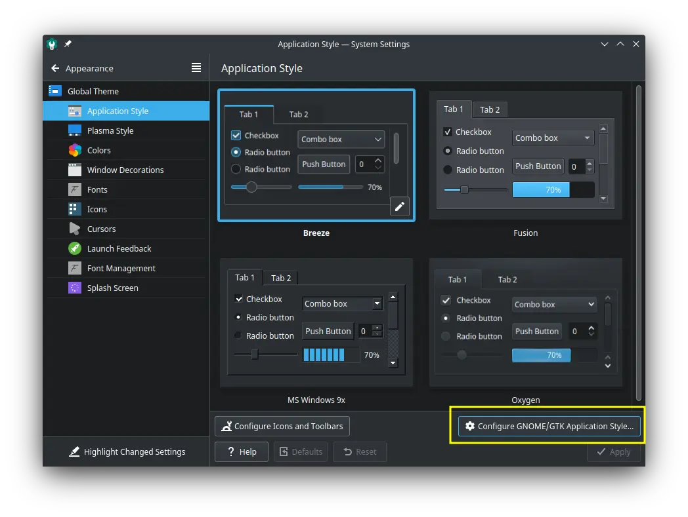
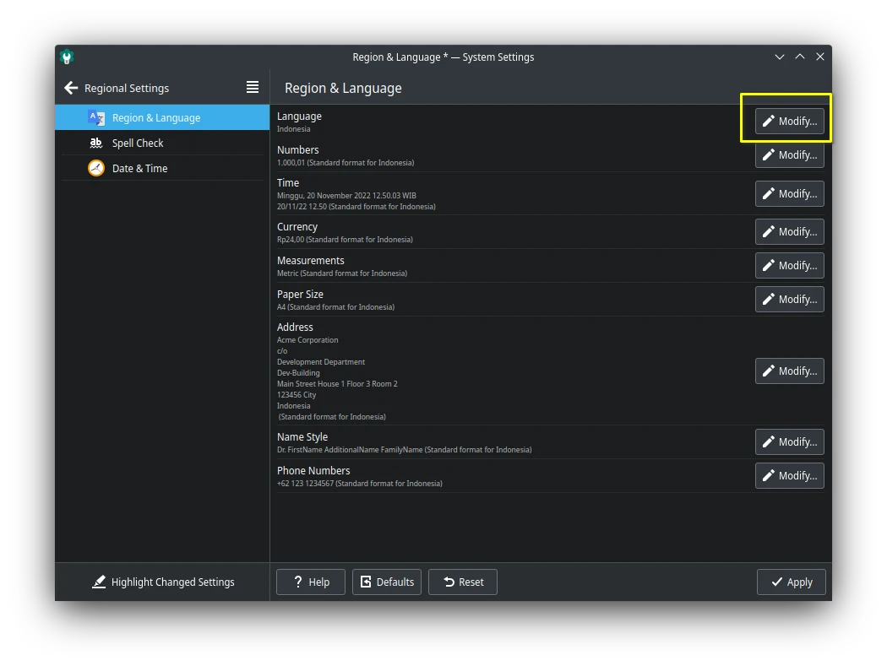
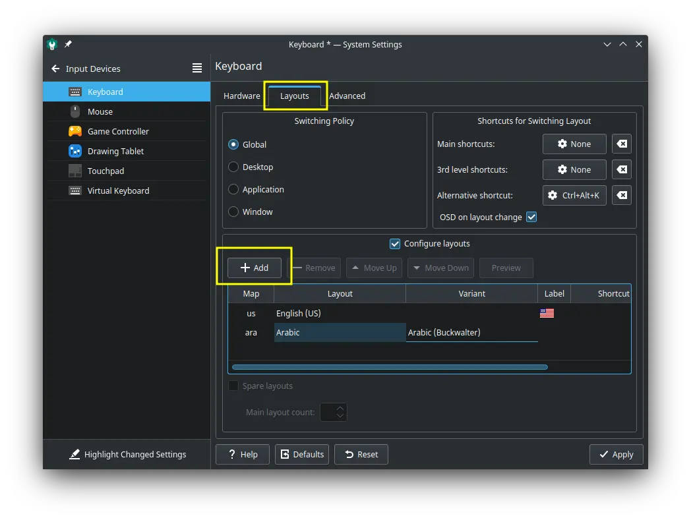

# Pengaturan sistem

## Mengaktifkan tap to click

Jika pengguna menggunakan laptop, kami sarankan untuk mengaktifkan tap-to-click agar dapat meng-tap touchpad. Hal ini diperlukan sebab jika menggunakan sesi Wayland secara bawaan tidak mengaktifkan tap-to-click.

- Buka `System Settings`.
- Pada bagian `Hardware` pilih `Input Devices`.
- Pilih `Touchpad`.
- Pada bagian Tapping, beri ceklis `Tap-to-click`.
- Klik `Apply`.

## Mengosongkan sesi awal

- Buka `System Settings`.
- Pilih `Startup and shutdown` > Pilh `Desktop session`.
- Pada pilihan `when logging in`, pilih `Start with an empty session`.
- Klik `Apply`.

## Mengganti global tema

- Buka di menu `Global Theme`.
- Pilih tema `Langitketujuh` atau tema yang diinginkan.
- Jika panel dan layout berantakan, serta ingin mengembalikan layout seperti semula. Maka berikan ceklis `Use layout desktop from theme`. Ini akan merubah panel, widget, dan wallpaper menjadi pengaturan layout awal.
- Klik `Apply`.

## Mengganti tema GTK

Beberapa perangkat lunak dibangun dengan `GTK+3` seperti inkscape dan GIMP. Tema keduanya tidak dipengaruhi oleh global tema plasma, melainkan melalui pengaturan style gtk. Untuk menggantinya melalui cara dibawah ini, tetapi kami tetap menyarankan untuk tetap menggunakan tema bawaan saja yaitu `Breeze`.

- Buka di menu `Global Theme`.
- Pilih `Application Style`
- Klik `Configure GNOME/GTK Application Style`.
- Pilih GTK Theme `Breeze` atau tema yang diinginkan.
- Klik `Apply`.

## Mengganti bahasa

- Buka `System Settings`.
- Pilh `Regional Settings` > Pilih `Languages`.
- Klik `Add Languages`, tambahkan Bahasa yang diinginkan.
- Klik bahasa yang dipilih, klik ikon `Promote to default`.
- Klik `Apply`.
- Efek pindah bahasa akan tampak setelah logout atau reboot.

## Menambahkan layout bahasa

- Buka `System Settings`.
- Pilih `Input Devices` > `Keyboard` > Pilih tab `Layout`.
- Tambahkan layout dengan klik `+Add`.
- Sebagai contoh, ganti `Any language` menjadi `Arabic`, Variant: `Arabic (Buckwalter)`.
- Pilih `Preview` untuk melihat tata letak.
- Jika sudah sesuai, klik `OK` dan `Apply`.

Pengguna akan melihat layout bahasa di bagian panel bawah. Untuk mengganti antar layout, tekan `ctrl+alt+k`.

