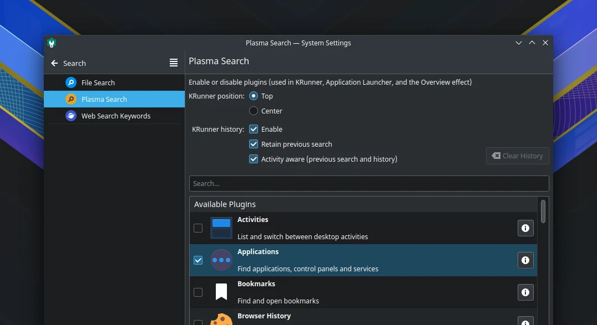

# Plasma pencarian

## Mengurangi plugin

Beberapa plugins tambahan di launcher menu KDE Plasma terlalu banyak yang aktif, akibatnya membuka menu menjadi lebih lama munculnya. Sehingga di LangitKetujuh perlu menonaktifkan plugin tambahan yang tidak diperlukan di pengaturan `Plasma Search`.

Plugin yang aktif antara lain:
- Applications
- Calculator
- Command line
- Kate Sessions
- Plasma Desktop Shell
- System Settings

Dengan berkurangnya plugin tambahan Krunner akan mempercepat durasi buka menu dan menghindari terjadinya galat plasma-shell.
