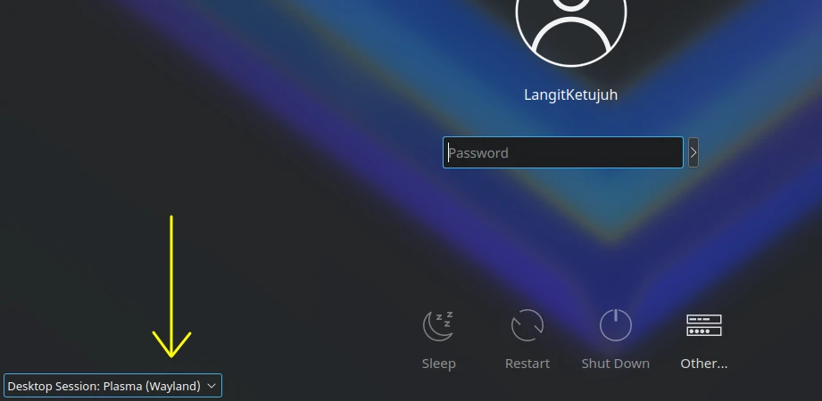

# Sesi desktop

## X11

[X11] adalah protokol sistem grafis untuk sistem operasi mirip UNIX yang dikembangkan sejak 1984. Dengan adanya X11, terdapat _Window Manager_ sehingga setiap aplikasi memiliki tampilan GUI.

## Wayland

[Wayland] merupakan sesi desktop lebih modern dari X11, performa lebih cepat dan lebih aman dalam memberikan akses perizinan portal desktop. Dikarenakan wayland masih baru diterapkan di distribusi linux, beberapa perangkat lunak masih belum kompatibel dengan wayland. Seperti perekam desktop SSR, screen share dengan zoom, dan display konfigurasi tablet. Solusi untuk mengatasi kurangnya fitur wayland kami sarankan untuk kembali menggunakan X11.

## Mengganti sesi desktop

- Buka menu, pilih `Restart`.
- Sebelum login, lihat dibagian pojok kiri bawah terdapat `Desktop session`.
- Ganti `Plasma (Wayland)`, menjadi `Plasma (X11)`. Atau sebaliknya.
- Kemudian login masukkan kata sandi.

[X11]:https://www.x.org/wiki
[Wayland]:https://wayland.freedesktop.org
