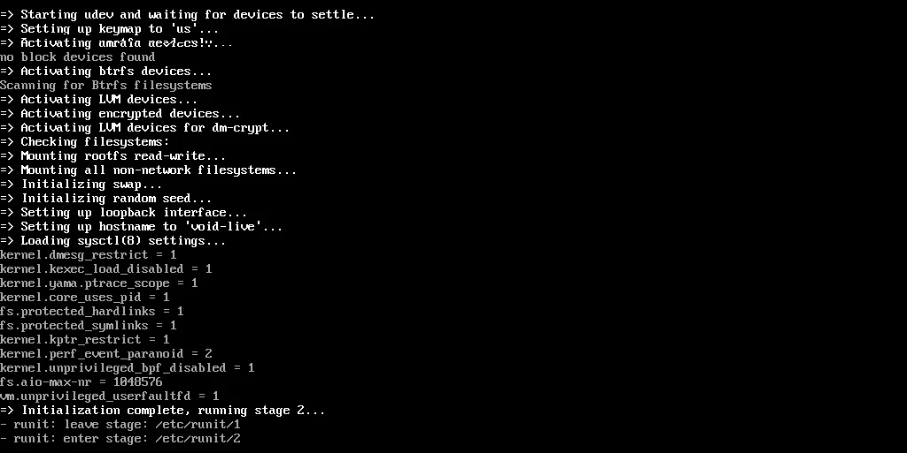

# Runit init

Init merupakan daemon proses yang terus berjalan hingga sistem dimatikan. Sedangkan [Runit](http://smarden.org/runit/) sendiri merupakan salah satu manajemen init pengganti [systemd](https://systemd.io/). Proses booting runit terlihat saat pertama kali menyalakan komputer.



Runit menggunakan perkakas `sv` untuk mengontrol layanan seperti melihat satus, mengaktifkan, menghapus, memberhentikan dan menyalakan ulang.

Sedangkan `vsv` memiliki fungsi yang sama dengan `sv` namun lebih mudah dan sederhana.

## Daftar layanan yang aktif

```bash
doas vsv
```

Atau

```bash
doas sv status /var/service/*
```

## Daftar layanan yang tersedia

```bash
ls /etc/sv/* -lah
```

Semua layanan tersedia di dalam direktori `/etc/sv/`.

## Status layanan

```bash
doas sv status <layanan>
```

Contoh:
```bash
doas sv status NetworkManager
```

## Mengaktifkan layanan

```bash
doas ln -s /etc/sv/<layanan> /var/service/
```

Contoh:
```bash
doas ln -s /etc/sv/dbus /var/service/
```

## Menonaktifkan layanan

```bash
doas rm /var/service/<layanan>
```

Contoh:
```bash
doas rm /var/service/tlp
```
