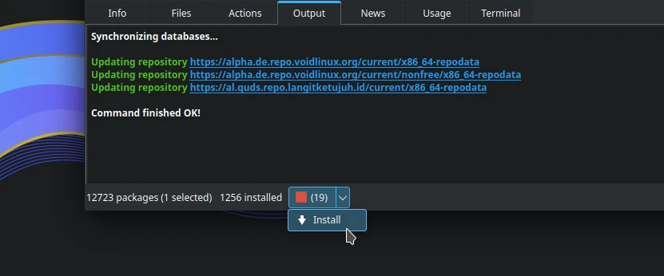
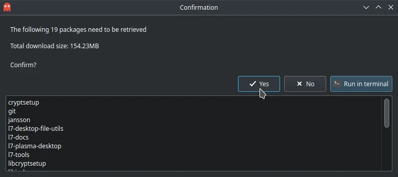

# Pembaruan Sistem

## Rilis bergulir

Sistem operasi LangitKetujuh menggunakan rilis bergulir (rolling release) untuk memperbarui setiap paket, sehingga perangkat lunak yang digunakan relatif terbaru dan lebih sering update. Meskipun demikian, ukuran dependensi lebih kecil dari pada distro pada umumnya.

## Update System

Sebelum memperbarui sistem pastikan sudah terhubung dengan jaringan internet. Kemudian perbarui sistem dengan cara mengklik **Update System** di menu favorit seperti dibawah ini.

Ada 5 tahapan yang dilakukan oleh Update System.

1. `Synchronization`, untuk sinkronisasi basis data yang terbaru dari server repositori.
2. `Full system upgrade`, proses mengunduh dan memasang dependensi yang terbaru. Ketik `y` untuk mengeksekusi.
3. `Check trouble and patch`, proses ini akan memeriksa jika ada yang bermasalah di grub, screen tearing intel, memeriksa sistem operasi dual boot dan lain sebagainya.
4. `Remove all old kernels?`, proses untuk menghapus kernel versi lama yang tidak digunakan. `Do you want to continue?` pilih `y` untuk memproses. Secara bawaan memilih `n` untuk tidak memproses.
5. `Remove obsolete and orphans packages?`proses untuk menghapus dependensi kedaluwarsa yang tidak digunakan. `Do you want to continue?` pilih `y` untuk memproses. Secara bawaan memilih `n` untuk tidak memproses.

Pembaruan dapat dilakukan saat memiliki waktu senggang saja, atau ketika ingin menggunakan perangkat lunak versi terbaru.

## OctoXBPS

Pembaruan dapat dilakukan juga melalui [octoxbps](../aplikasi/perkakas/octoxbps.md) dengan mengklik `Install` di bagian status bar. Adanya paket yang perlu diperbarui terlihat dengan tanda warna merah seperti dibawah ini.

Kemudian klik `Yes` untuk menjalankan proses pembaruan sistem.

